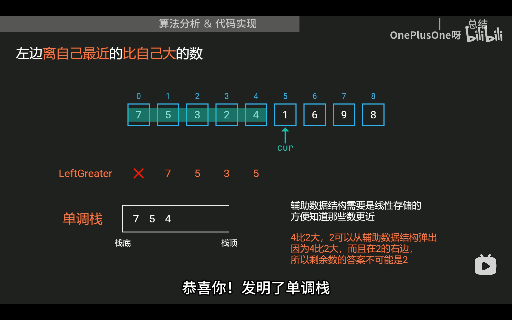
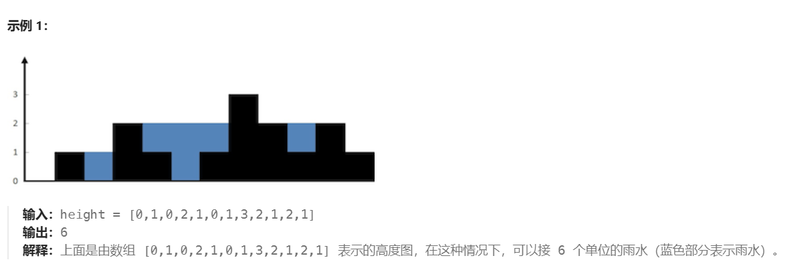

# 接雨水

## 1. 知识点

### 1.1. 单调栈



`ans` 一般就是 **“answer”** 的缩写。

#### 1.1.1. 哪些题“几乎都是单调栈解法”？

严格说，**几乎没有题是“必须”单调栈**：你总可以 O(n²) 暴力硬上，只是会超时/不优雅。
 面试、刷题里，下列类型题目**标配解法**就是单调栈：

##### 类型 A：为每个元素找“最近的更大/更小元素”

关键词：

> 对于数组中每个元素，找：
>
> - 右边第一个比它大/小的
> - 左边第一个比它大/小的

典型题：

- **Next Greater Element / 下一个更大元素**（496、503）
- **每日温度**（739）：对每一天，找右边第一个更高温度的那天
- 股票跨度、下一个更小元素、山峰问题等

这类如果暴力是这样：

```
for i in range(n):
    for j in range(i+1, n):
        if nums[j] > nums[i]:
            ans[i] = j
            break
```

→ O(n²)。
 用单调栈可以 O(n) 跑完，这是经典场景。

------

##### 类型 B：每个元素当“最小值/最大值”时，管辖的左右边界

关键词：

> “以某个元素为最小（或最大）的时候，它能扩展到左右多远？”

典型题：

- **柱状图中最大的矩形**（84）
- 子数组最小值之和 / 最大值之和
- 有序子数组长度、山谷面积等

这些本质都是：
 对每个 `i`，找“左边第一个比它小的”“右边第一个比它小的”，
 于是 `i` 作为最小值的影响范围就是 `(left, right)` 之间。

这类题如果你发现题目在说：

- “子数组最小值之和”
- “以 height[i] 为高的最大矩形面积”

那 90% 时间就是单调栈。

------

##### 类型 C：形状问题，左右更高的墙夹中间 —— 接雨水 / 柱子

- **接雨水（42）** —— 你刚做这题
- **柱状图最大的矩形（84）** 也是类似思想
- 一些“山峰、山谷”题也会用到

特点是：

> 需要知道“左边第一个比我高”和“右边第一个比我高/不低”的位置，
>  然后用它们来算面积 / 水量。

给你一个**脑内 checklist**，看完题目问自己：

1. 题目有没有这种话：
   - “**下一个** 更大的 / 更小的元素”
   - “距离右边/左边第一个 xxx 的位置”
   - “最近的比它高/低的柱子/温度/价格”
2. 或者：
   - “每个位置作为最小（或最大）的时候，对答案贡献多少？”
   - “以 height[i] 为高的最大矩形是什么？”
3. 或者：
   - “被 **左右两边更高的东西** 夹住的一段区域能产生多少东西（水/面积/能量）？”

如果有其中一个，你就先往“单调栈”方向想 80%。

------

#### 1.1.2. 单调栈方法

##### 3.1 `append` —— 压栈（push）

```
st = []
st.append(3)   # st = [3]
st.append(5)   # st = [3, 5]
```

这就是“往栈里压一个元素”。

------

##### 3.2 `pop` —— 弹栈（pop）

```
st = [3, 5, 7]
x = st.pop()
print(x)   # 7
print(st)  # [3, 5]
```

- 默认 `pop()` **删除并返回最后一个元素**，非常像“弹栈”操作。
- 也可以写 `st.pop(0)` 删除下标为 0 的元素，不过做栈一般用默认的。

在这题里：

```
bottom_h = height[st.pop()]
```

意思是：

1. 从栈顶弹出一个下标：`mid = st.pop()`
2. 用这个下标取出高度：`bottom_h = height[mid]`

------

##### 3.3 `not st` / `if st` 判空

- `if st:`   → st 不是空，就会进入
- `if not st:` → st 是空，就会进入

相当于：

```
if len(st) == 0:  # 栈空
    ...
```

在代码里：

```
bottom_h = height[st.pop()]
if not st:
    break
left = st[-1]
```

含义是：

- 先弹出了“谷底”的那根柱子
- 如果弹完以后栈空了 → 说明左边已经**没有墙**了 → 没法形成一个“桶” → 直接 break
- 如果栈不空 → `st[-1]` 就是左侧的那堵墙

> **Python 里面“列表”和“栈”是不是同一个东西？**

答案是：

- **从 Python 语言 / 内存角度看：**
   你写的 `[]` 都是 **list 类型**，没有什么“专门的 stack 类型”。
- **从算法 / 数据结构角度看：**
   “栈”是一种**抽象的用法和约束**，通常是“后进先出”（LIFO）。

也就是说：

> 在代码里，**栈是用 list 实现出来的一种“使用方式”**，
>  列表是工具，栈是你如何使用这个工具。

------

#### 1.1.3 区分list和stake

##### 1. 同一个 `[]`，不同“角色”

举个类比：

- 一张桌子本身就是“桌子”（list）
- 你把它当“饭桌”用，就叫饭桌；你把它当“办公桌”用，就叫办公桌
   → 桌子没有变，变的是“用途”和“规则”

在代码里也是一样：

```
height = []   # 我当它是“数组 / 列表”用
st = []       # 我当它是“栈”用
```

**底层都是 list，但我们对它们的“操作方式”和“含义”不一样：**

##### 2. 当它是“普通列表”时，你会这么用：

```
nums = [3, 1, 4, 2]
nums[0] = 10           # 随机访问、修改
nums.insert(1, 99)     # 在中间插入
nums.pop(0)            # 删第一个
nums.sort()            # 排序
```

→ 重点：**可以任意下标访问、插入、删除，没有特殊约束。**

------

##### 3. 当它是“栈”时，你会强迫自己只这样用：

```
st = []

# 压栈（push）
st.append(x)

# 读栈顶（peek）
top = st[-1]

# 出栈（pop）
x = st.pop()
```

**不用：**

- `st.insert(0, x)`
- `st.pop(0)`
- `st.sort()`
- 随便改中间 `st[3] = 100` 之类的

→ 你**自觉地只用“尾部压入 / 尾部弹出”这一套操作**，就等价于在用一个“栈”。

> 所以区别不在于 `[]` 的写法，而在于：
>  **你对这个 list 施加了“只能栈式操作”的约束，它就扮演了“栈”的角色。**

#### 1.1.4 单调栈用法：

##### 3.1 通用模板（必须会背）

###### 一、先背一个**单调栈通用模板**

几乎所有单调栈题，代码框架都是这个样子（Python）：

```python
st = []  # 存下标 / 值，看题目需求
ans = ...

for i, x in enumerate(arr):     # 一般从左到右扫一遍
    # 1️⃣：只要当前元素 x 会“破坏单调性”，就反复弹栈
    while st and 破坏单调性的条件(x, st[-1]):
        j = st.pop()            # j 是被“解决掉”的那个元素
        # 这里用：当前元素 i + 弹栈后新的栈顶，来更新答案

    # 2️⃣：当前元素还没进栈，作为将来的候选
    st.append(i)

return ans
```

写单调栈的时候，你只需要回答 4 个问题：

1. **栈里存什么？**（下标还是高度？）
2. **栈要保持什么单调性？**（单调递增 / 递减？）
3. ==**什么时候 while 弹栈？**（即“破坏单调性”的条件是什么？）==
4. ==**弹栈时拿谁更新答案？**==
   - 被弹出的元素：`j`
   - 弹完后的栈顶：左边界 / 上一个更大/更小的
   - 当前 i：右边界 / 下一个更大/更小的

搞定这 4 点，把它们塞进上面这个模板，单调栈代码就写完大半了。

------

###### 二、用“接雨水”这题从零设计一次代码

> 不看答案代码，只从图和你手算的过程，反推这 4 个问题。

###### 第 0 步：先想“什么时候产生一块水？”

一块水坑需要三根柱子：

- 左边界：比底高
- 底部：最低那根柱
- 右边界：比底高

从左往右扫的时候，你能明显感觉到：

> ==“当我遇到一根比中间那根低柱子更高的右柱子时，中间这个低柱就被封住了，可以结算水了”==

也就是说：
 **“当前柱子变高了，并且超过了某个左边的低柱子”**
 ==这是“需要结算”的触发条件。==

==这个“左边的低柱子”、以及它左边更高的柱子，就是我们要在栈里维护的信息。==

------

###### 第 1 步：栈里存什么？

结算一块水时，你要用到的信息有：

- 底部的高度 → 某个下标 `bottom`
- 左边界的高度 → 某个下标 `left`
- 右边界就是当前 `i, h`

只有存下标才能同时：

- 通过 `height[idx]` 拿到高度
- 通过 `i - left - 1` 算宽度

👉 所以：

> **栈里存的是“下标 i”**

```
st = []   # 存的是 index
```

------

###### 第 2 步：栈要单调成什么样？

我们希望栈里大概长这样：

- 从左到右，高度是**单调递减**：

```
栈底            栈顶
  higher → lower → lower → 最矮
```

为什么？
 ==因为我们希望**栈顶是“当前最低的那个坑底”**，并且它左边一定有比它高的（在它下面那一层）。==

这样一来：

==**当来了一个新柱子 `h` 时，只要 `h >= 栈顶高度`，**==
 就说明：
==“**右边出现了一个不比底矮的柱子，该底可以配合左边界一起结算水了”。**==

所以：

> **栈维持的是“高度单调递减”的下标栈**

单调递减的维护规则就是：

```
while st and height[st[-1]] <= h:
    # 当前 h 把栈顶 st[-1] “压扁了”，需要弹出结算
```

这行你已经理解了，现在是反过来理解：
 这是为了保持“从栈底到栈顶高度递减”，只要新来的 `h` 比栈顶高，就会破坏递减性，所以要弹。

------

###### 第 3 步：弹栈时怎么更新答案？

此时我们已经知道：

```
bottom = st.pop()        # 这是刚刚被压扁的“坑底”
bottom_h = height[bottom]
```

如果栈被弹空了，说明左边已经没有边界了，这个 bottom 没法形成水坑：

```
if not st:   # 没有左边界
    break
```

否则：

- `st[-1]` 是 bottom 左边最近的一根“高柱子” → 左边界 `left`
- 当前 `i` 是右边界

```
left = st[-1]
right = i
```

水的高度 = “两边较矮的那根 - 底部高度”：

```
dh = min(height[left], height[right]) - bottom_h
```

水的宽度 = `right - left - 1`（左右不算在水的宽度里）：

```
width = right - left - 1
```

体积 = 高 * 宽：

```
ans += dh * width
```

你会发现，这里其实就是“你手动推导过程”中一直在用的那三个角色：`left / bottom / current`。

把它们写进模板后，代码自然就出来了。

------

###### 第 4 步：填入完整模板

带着上面 4 个问题的答案，我们直接“填空”：

```python
class Solution:
    def trap(self, height: List[int]) -> int:
        ans = 0
        st = []  # 1️⃣ 栈里存下标，代表还没结算完的柱子

        for i, h in enumerate(height):
            # 2️⃣ 要维持的是：高度单调递减的栈
            while st and height[st[-1]] <= h:   # 3️⃣ 当前h把栈顶压扁，触发结算
                bottom = st.pop()              # 坑底
                bottom_h = height[bottom]

                if not st:                     # 4️⃣ 栈空：左边界不存在，无法结算
                    break

                left = st[-1]                  # 左边界
                dh = min(height[left], h) - bottom_h
                ans += dh * (i - left - 1)

            st.append(i)                       # 当前柱子入栈，做未来的“坑底 / 左边界”
        return ans
```

你会看到，这不是“凭空想代码”，而是按顺序回答问题：

1. 需要哪些历史信息？→ 下标
2. 希望栈顶表示谁？→ 当前最低的坑底 → 整体单调递减
3. 什么时候坑底被“封住”？→ 当前高度 ≥ 栈顶高度
4. 一旦封住，三根柱子是谁？
   - 底：刚弹出的
   - 左：新的栈顶
   - 右：当前下标 i
      → 写出高度和宽度公式

###### 3.2 用一个最简单的例子走一遍：每日温度（Next Greater On Right）

题目简化版：

> 给定温度数组 `temps`，对每一天 i，求**右边第一个更高温度**的位置距离，否则为 0。

**思路：**

- 我们从左到右扫温度
- 栈里存“还没找到更高温度的那些天的下标”
- 栈保持**温度单调递减**：
  - 如果新来的温度 `h` 比栈顶那天温度高，说明栈顶那天第一次遇到“右边更高的温度”

**套模板：**

```
def dailyTemperatures(temps):
    n = len(temps)
    ans = [0] * n
    st = []  # 单调递减栈，存下标

    for i, t in enumerate(temps):
        # 新温度 t 比栈顶那天的温度高 → 找到“下一个更高”
        while st and temps[st[-1]] < t:
            idx = st.pop()
            ans[idx] = i - idx   # 右边更高温度的距离
        st.append(i)

    return ans
```

你会发现，这个写法和接雨水的 while 完全一个模式：

```
while st and height[st[-1]] <= h:
    bottom = st.pop()
    ... 用 bottom 和 i (右边界) 以及 st[-1] (左边界) 做事
```

区别只是：“弹出的时候，你到底算啥”。

------

###### 3.3 再抽象成“写代码步骤”，以后照着做

以后遇到怀疑是单调栈的题，可以按这四步走：

###### 第 1 步：弄清楚你想知道“相邻谁和谁”的关系

比如：

- 每个元素，右边第一个比它大的 → `idx` 弹出时，右边就是 `i`
- 每个柱子，左边第一个比它小的 → 可以从右往左扫，或者做两次栈
- 接雨水：某个“谷底”被左、右两边较高柱子夹住 → 谷底（弹出的 idx）、左边界（弹后新的 st[-1]）、右边界（当前 i）

**一个元素被弹栈时，你要把它和谁关联？**

###### 第 2 步：决定栈存“值”还是“下标”

> 大部分题：**存下标（index）**
>  因为下标能拿到：
>
> - 值：`nums[i]`
> - 距离：`i - idx`

所以像接雨水、每日温度、下一个更大元素、柱状图面积，基本都存下标。

###### 第 3 步：决定栈的“单调方向”和 `while` 条件

记忆法：

- 想找“右边第一个 **更大** 的”：
  - 栈里要保持一个“**从栈底到栈顶单调递减**”的序列
  - 新来的值大，就一边弹一边记录它是它们的“右边更大”
  - 条件：`while st and nums[st[-1]] < x:`
- 想找“右边第一个 **更小** 的”：
  - 栈里保持“**单调递增**”
  - 新来的变小，就一边弹一边记录
  - 条件：`while st and nums[st[-1]] > x:`
- 接雨水这种：
  - 我们需要“谷底 ≤ 左右两边墙”，所以用 `<=`。

###### 第 4 步：填充“弹出时要做的事”

常见几种：

- 记录边界：

  - `right[idx] = i`（idx 右边第一个更大/更小的）
  - `left[idx] = st[-1]`（弹出后新的栈顶）

- 直接算贡献（接雨水、柱状图最大矩形）：

  - 接雨水：

    ```
    bottom = st.pop()
    left = st[-1]
    dh = min(height[left], height[i]) - height[bottom]
    ans += dh * (i - left - 1)
    ```

  - 柱状图最大矩形（类似，只是公式略不同）

## 1.2. zip对齐

### 1.2.1. `zip(height, pre_max, suf_max)` 在干嘛？

简单说：

> **zip 就是把多个“并排的列表”打包在一起，一次性按下标对齐遍历。**

举个小例子：

```
a = [10, 20, 30]
b = [ 1,  2,  3]
c = [ 7,  8,  9]

for x, y, z in zip(a, b, c):
    print(x, y, z)
```

输出：

```
10 1 7    # 来自 a[0], b[0], c[0]
20 2 8    # 来自 a[1], b[1], c[1]
30 3 9    # 来自 a[2], b[2], c[2]
```

也就是说：

- 第 1 次循环得到的是 `(a[0], b[0], c[0])`
- 第 2 次得到 `(a[1], b[1], c[1])`
- 第 3 次得到 `(a[2], b[2], c[2])`

### 1.2.2 对比前后缀分解和相向双指针

#### 1. 两个套路各自究竟在干嘛？

##### ① 相向双指针（two pointers from both ends）

**典型形态：**

```
l, r = 0, n-1
while l < r:
    # 用 nums[l], nums[r] 做一些判断
    if 条件1:
        l += 1   # 或者 r -= 1
    else:
        r -= 1
```

**本质：**

- 数组**有序或“某种单调”**（通常是先 sort 一下）
- 我们关注的是一个**区间 [l, r] 里面是否存在/构成某种性质**
- 每一步通过比较“当前两端的情况”，**决定往哪边缩小区间**，并且保证不会漏掉答案
- 每个元素最多被移动指针扫描常数次 → 时间 O(n)，空间 O(1)

典型题：

- Two Sum（对排序数组），3Sum，4Sum
- 盛最多水的容器
- 验证回文串（左右指针向中间走）
- Move Zeroes / Remove Duplicates 这类有时也可以理解为“同向双指针”，本质还是用指针缩小/重排有效区间。

##### ② 前后缀分解（prefix / suffix decomposition）

**典型形态：**

先从左到右做一个“前缀数组”：

```
pre[0] = 基础值
for i in range(1, n):
    pre[i] = f(pre[i-1], nums[i])
```

再从右到左做一个“后缀数组”：

```
suf[n-1] = 基础值
for i in range(n-2, -1, -1):
    suf[i] = g(suf[i+1], nums[i])
```

最后对每个位置 i，把 `pre[i-1]` 和 `suf[i+1]` 组合一下得到答案。

**本质：**

- 对于“每个位置 i 的答案”，都需要**同时知道左边整体的信息 + 右边整体的信息**
- 这些“整体信息”可以通过一个**单调递推**维护（max、sum、product、min…）
- 用两趟遍历，把“左边累积结果”、“右边累积结果”都算出来，最后 O(1) 合并
- 时间 O(n)，空间 O(n)（可以有优化空间）

典型题：

- Product of Array Except Self（除自身以外数组的乘积）
- 接雨水（用 left_max / right_max 的前后缀）
- 对每个位置统计“左边有多少个比它小、右边有多少个比它大”等
- 前缀和（subarray sum），前缀最小/最大等。

#### 1.2.3 怎么选择算法

##### ✅ 更像是“搜索某个区间 / 某对元素”的 → 想相向双指针

请问你在做的这道题，是否满足：

1. **目标是找到满足条件的一对或少量组合**（比如两数/三数/四数），而不是给**每一个位置都算一个答案**？
2. 可以把数组 **排序**，并且排序后不影响题意（比如只要数值，不在乎原始索引顺序）？
3. 当你有一个区间 `[l, r]` 时，你可以：
   - 通过比较 `nums[l]`、`nums[r]` 和某个 target / 条件
   - **确定往哪一边移动 l 或 r 才不会漏解**？

如果这三个问题大致都是“是”，那就是**相向双指针高概率适用**。

典型模式：

- 三数之和：固定 k，在有序数组 (k+1..n-1) 上用双指针
- 两数之和（有序）：`l,r` 两端逼近
- 盛水容器：比较 `height[l]` 和 `height[r]`，移动较小的一侧
- 验证回文：比较 `s[l]` 和 `s[r]`，向中间收缩

**关键词：** “找一对 / 少量解”、“排序 + 缩区间”、“有单调性，能淘汰一大块”.

------

##### ✅ 更像是“每个位置都要一个结果，且结果涉及左右两边信息”的 → 想前后缀

再问自己一组问题：

1. 题目要的是**对每个下标 i 算一个答案**（而不仅是全局找一两个组合）？
2. 每个位置 i 的答案都长得像：
    `Ans[i] = F(左边整体的信息, 右边整体的信息, 自己)`？
3. 左/右信息可以用**线性递推**维护，比如：
   - `prefix[i] = f(prefix[i-1], nums[i])`
   - `suffix[i] = g(suffix[i+1], nums[i])`

如果是，那多半就是**前后缀套路**：

- Product Except Self：
   `leftProd[i]` = 左边所有数的乘积，
   `rightProd[i]` = 右边所有数的乘积，
   `ans[i] = leftProd[i] * rightProd[i]`
- 接雨水：
   `leftMax[i]` = 左边最高的柱子
   `rightMax[i]` = 右边最高的柱子
   `water[i] = min(leftMax[i], rightMax[i]) - height[i]`
- 前缀和：
   `prefix[i] = sum(nums[0..i])`，子数组和 `sum(l..r) = prefix[r] - prefix[l-1]`

**关键词：** “每个位置都有答案”、“要同时知道左边与右边”、“左右信息可以提前预处理”。

## 1.3 详解双指针问题

#### 1.3.1. 先回答你：双指针**不是**一定“双向相对走**

“双指针”这个名字容易让人误解，以为就是：

```
l, r = 0, n-1
while l < r:
    ...
```

其实“双指针”只是说：**我们同时维护两个下标/指针来访问同一份数据结构**，它们往哪个方向走是看具体问题的。

常见几种形态：

1. **相向双指针**：一个从左，一个从右 → 你刚做的 3Sum、盛水容器、回文串验证
2. **同向快慢指针**：两个都从左往右，但速度不同 → 链表找中点、检测环、删除倒数第 n 个节点
3. **滑动窗口**：两个都从左往右，一个维护窗口左边界，一个维护右边界 → 最长子数组 / 子串、和不超过 K 的子数组等等
4. **读写指针（重排 / 去重）**：一个读，一个写 → 去重、移除元素、移动零、原地 partition

所以答案是：

> ❌ 不是“经常都是双向”
>  ✅ 而是“有时候相向、有时候同向、有时候一个快一个慢”，**取决于你想维护的“区间 / 关系 / 不变量”是什么**。

------

#### 1.3.2. 几种常见形态各自的“小精华”

##### ① 相向双指针：**在有序/单调结构上“夹逼缩区间”**

典型写法：

```
l, r = 0, n-1
while l < r:
    # 用 nums[l], nums[r] 做决策
    if 条件1:
        l += 1
    else:
        r -= 1
```

使用场景（你现在最熟的）：

- 3Sum/4Sum：固定前面几个数，在有序数组上用 `i, j` 从两端夹
- Two Sum（有序数组）
- 盛最多水的容器：比较 `height[l]` 和 `height[r]`，谁短移谁
- 回文判断：`s[l] == s[r]`，往中间缩

**核心思想：**

1. 数组**有序或某种单调** → 当你往某一边移动时，“你关注的量”会**单调变化**（和变大/变小、宽度变小……）
2. 每一步用边界的信息判断“哪边一定不会产生更好的答案”，于是把那一边缩掉
3. 两个指针都只往一个方向走，不会回头 → 每个元素最多被看几次 → 把原本 O(n²) 的成对枚举压成 O(n)

你之前对三数之和的理解已经很接近这种本质了：

> 排序之后，双指针就是在“**有序空间里不断缩小搜索区间**”。

------

##### ② 同向快慢指针：**用“相对速度/距离”表达关系**

比如链表题：

```
slow = fast = head
while fast and fast.next:
    slow = slow.next        # 1 步
    fast = fast.next.next   # 2 步
```

用来：

- 找中点（fast 到终点时，slow 在中点）
- 判环（fast 追上 slow 就有环）

数组里也有类似的：

- 去重 / 移除元素 / 移动零：
  - `i`：扫描指针（读）
  - `j`：写入指针（下一个有效元素要放的位置）
     本质也是两个指针同向推进。

**核心思想：**

> 用“两个位置（或两个速度不同的指针）之间的相对关系”，来表达题目的某种约束或信息（比如“中点”、“距离 k”、“只保留非零元素”），这样同样一遍扫完即可。

------

##### ③ 滑动窗口：**维护一个“动态区间”满足/尽量满足某个条件**

典型代码：

```
l = 0
for r in range(n):
    # 扩大右边界，把 nums[r] 加入窗口
    更新窗口状态

    while 窗口不满足条件:
        # 缩小左边界
        更新窗口状态
        l += 1

    # 此时窗口 [l, r] 满足某种条件，可以用来更新答案
```

使用场景：

- 最长不含重复字符的子串
- 和不超过 / 不小于某个值的子数组
- 至多包含 K 个不同字符的最长子串…

**核心思想：**

> 用两个指针 `[l, r]` 表示一个“当前窗口”，
>  不断向右扩展 r，同时通过移动 l 保证窗口始终满足某种性质，
>  在这个过程中更新答案。
>  每个元素最多被 l、r 各经过一次 → 线性时间。

------

##### ④ 读写指针 / 原地重排：**用两个指针区分“已经处理完”和“待处理”区域**

像你刚写的“移动零”：

```
j = 0                    # 写指针，表示下一个非零要放的位置
for i in range(n):       # 读指针
    if nums[i] != 0:
        nums[j], nums[i] = nums[i], nums[j]
        j += 1
```

或者“原地删除指定元素”、“原地去重”等。

**核心思想：**

> 一个指针负责“扫描所有元素”，另一个指针负责“维护已经压缩/过滤好的前缀”。
>  这样你不用开新数组，原地就能完成重排 / 过滤。

------

#### 1.3.3. ==那么，双指针的“精华”到底是什么？==

我用几句不同层次的话概括一下，你看哪个最能戳中你：

------

##### （1）算法复杂度视角

> **用两个只能“往前走”的指针，
>  把原本需要二重循环枚举的东西，
>  压缩到一重循环就能做完。**

- 原本是 O(n²)：枚举所有 `(i, j)` 对
- 双指针之后：
  - `i` 只单调地从左走到右
  - `j` 只单调地从右走到左 / 或从左走到右
     整体只花 O(n) 或 O(n log n)（如果需要排序）

------

##### （2）空间/数据结构视角

> **用“指针的位置”来表示我们现在关注的区间、窗口或状态，
>  而不是额外建很多数组或结构。**

- `[l, r]` 表示当前窗口
- `[0, j-1]` 表示已经清洗好的数据前缀
- `(l, r)` 表示当前搜索区间

你会发现很多题目，如果不用双指针，通常要么：

- 暴力嵌套循环；
- 要么开很多辅助数组/哈希表。

双指针是“用几个整数下标就解决复杂逻辑”的套路。

------

##### （3）不变量 / 单调性视角（偏“思维模型”）

几乎所有正确的双指针解法，都满足两个关键点：

1. **有一个“全程保持”的不变量**
   - 如 3Sum 里：区间 `(i, j)` 始终是“针对此刻 k 的候选区间”；
   - 盛水容器里：答案只可能出现在“当前宽度下较短的一边”；
   - 滑动窗口里：窗口 `[l, r]` 始终“满足 / 或刚刚超过某个条件”。
2. **指针只朝一个方向单调移动，不回头**
   - 因为一旦回头，就失去了 O(n) 的优势，又变成 O(n²) 级别。

你可以把“双指针的精华”理解成：

> **利用问题中的“单调性 + 不变量”，
>  设计两个只往前移动的指针，
>  来有序地缩小搜索范围 / 维护一个窗口 / 跟踪相对位置，
>  从而避免重复枚举。**

------

##### 4. 帮你形成一个“脑内模板”

以后做数组/字符串/链表题，你可以在脑子里套用这样一个流程：

1. **如果暴力需要两重循环枚举 i、j：**

   - 问自己：

     > 能不能让 i、j 都只往一个方向走，
     >  每次根据当前局部信息决定移动谁，
     >  同时保证不会漏解？

   - 如果可以，很可能就是某种“双指针”。

2. **如果题目涉及“某个区间 / 子串 / 子数组”的性质：**

   - 问自己：

     > 能不能用 [l, r] 表示当前窗口，
     >  然后一边扩 r，一边收 l？

   - 能的话就是“滑动窗口型双指针”。

3. **如果题目要求“原地修改数组 / 去掉某些元素 / 压缩数组”：**

   - 问自己：

     > 能不能用一个指针扫数组，
     >  另一个指针维护“已经处理好的前缀”？

   - 能的话就是“读写指针型”。

4. **如果题目是“找回文 / 找和为某值的一对 / 容器面积 / 最远间距”这种“两端的信息很重要”的：**

   - 优先想“相向型双指针”。

## 2. 代码

### 1. 先复习一下 `range(start, stop, step)` 规则

- `start`：起始值（包含）
- `stop`：结束值（**不包含**）
- `step`：步长，可以是负数

所以：

```
range(5, -1, -1)
# 会产生：5, 4, 3, 2, 1, 0
# 到 -1 停止，但不包含 -1
```

**重点：**「不包含 `stop`」这一点非常重要。

------

### 2. 对着下标理解：为什么是 `n-2, -1, -1`

数组下标是 `0 .. n-1`，后缀最大值我们是这样处理的：

1. 先单独处理最右边一格：

   ```
   suf_max[-1] = height[-1]    # 也就是 suf_max[n-1] = height[n-1]
   ```

   所以后面的循环只需要处理 **从 `n-2` 到 `0` 的位置**。

2. “从 `n-2` 到 `0` 倒着走” 用 `range` 怎么写？

   - 起始：`n-2` ✅
   - 结束：要走到 `0`，因此 `stop` 要写成 **比 0 再小一点** 的值，因为 `stop` 本身不包含
      → 写成 `-1`，这样就会走到 `0` 为止
   - 步长：每次减 1 → `-1`

   所以就是：

   ```
   for i in range(n-2, -1, -1):
       ...
   ```

> 这行代码的实际含义是：
>  **i = n-2, n-3, ..., 2, 1, 0**
>
> 为什么是n-2开始，因为倒数第一个已经处理了，自然就是倒数第二个开始

### 方法一：前后缀分解

```python
class Solution:
    def trap(self, height: List[int]) -> int:
        n = len(height)
        pre_max = [0] * n  # pre_max[i] 表示从 height[0] 到 height[i] 的最大值
        pre_max[0] = height[0]
        for i in range(1, n):
            pre_max[i] = max(pre_max[i - 1], height[i])

        suf_max = [0] * n  # suf_max[i] 表示从 height[i] 到 height[n-1] 的最大值
        suf_max[-1] = height[-1]
        for i in range(n - 2, -1, -1):
            suf_max[i] = max(suf_max[i + 1], height[i])

        ans = 0
        for h, pre, suf in zip(height, pre_max, suf_max):
            ans += min(pre, suf) - h  # 累加每个水桶能接多少水
        return ans
```

### 方法二：相向双指针

```python
class Solution:
    def trap(self, height: List[int]) -> int:
        ans = pre_max = suf_max = 0
        left, right = 0, len(height)-1
        while left < right:
            pre_max = max(pre_max, height[left])
            suf_max = max(suf_max, height[right])
            if pre_max < suf_max:
                ans += pre_max - height[left]
                left += 1
            else:
                ans += suf_max - height[right]
                right -= 1

        return ans
```

### 方法三：单调栈

上面的方法相当于「竖着」计算面积，单调栈的做法相当于「横着」计算面积。

这个方法可以总结成 16 个字：**==找上一个更大元素，在找的过程中填坑。==**

注意 while 中加了等号，这可以让栈中没有重复元素，从而在有很多重复元素的情况下，使用更少的空间。

>  点评：看复杂度的话，单调栈不如双指针的做法。但如果输入的 height 是一个流（stream），只能从左到右遍历，那么单调栈（在这种场景下）就是不错的方法了。

#### 0. ==重点概念解释说明理解==

##### 1.  栈st到底存的什么？

**栈 `st` 里存的是：柱子的“下标 i”**，而不是高度本身。
 要看某根柱子的高度，就用 `height[st[-1]]` 这样的写法。

为什么要存下标而不是直接存高度？

1. 既可以拿到高度 `height[i]`
2. 又可以算两根柱子之间的**距离（宽度）**：`i - left - 1`
    这里 `i` 和 `left` 都是下标，所以可以直接相减得到中间夹着多少根柱子。

同时，这个栈还有一个重要性质：

> **从栈底到栈顶，高度单调递减**
>  即：`height[st[0]] >= height[st[1]] >= ... >= height[st[-1]]`

所以它叫**单调递减栈**（monotonic decreasing stack）。

这些“单调递减的柱子下标”，代表的是**还没结算完的“左边界 / 低洼 / 右边界候选”**。
 一旦来了一根比它们高的柱子，说明“低洼区封口了”，可以算水了。

##### 2. `while st and height[st[-1]] <= h` 在做什么？

- `st`：判断栈是否非空（空栈就不能访问 `st[-1]`）
- `st[-1]`：栈顶元素，是某一根柱子的下标
- `height[st[-1]]`：栈顶那根柱子的高度
- `h`：当前正在遍历的这根柱子的高度

条件翻译成人话就是：

> ==**“当栈不空，并且当前柱子的高度 `h` ≥ 栈顶柱子的高度”时，一直循环处理。**==

为什么“当前柱子 ≥ 栈顶柱子”就要动手算水？

画面感这么想：

- 栈内高度是 单调递减 的，比如从底到顶依次是：高 → 中 → 低
- 现在来了一个新柱子，高度 = `h`

### 图形想象

假设栈里从底到顶（左到右）高度是：

`left 高柱`（在栈底） → `bottom 低柱`（在栈顶）

高度示意：

```
left:   3   |
bottom:    0|
current:       2|
```

当当前柱子的高度 `h` 比栈顶 `bottom` 高时：

- 左边有一根比 bottom 高的柱子（left）
- 右边来了一个比 bottom 高的柱子（current）

这就形成了一个凹槽：`left` —— `bottom` —— `current`，中间的 `bottom` 就是**凹槽最低点**。
 所以可以围出一块可以装水的区域。

于是就进入 `while` 循环，执行：

```
bottom_h = height[st.pop()]
```

把中间这个“底”弹出来，当做“凹槽底部的高度”。

然后看看**新的栈顶**（也就是 `bottom` 左边的那根柱子），当做“左边界”，当前柱子当“右边界”，就可以算这一块水的体积了。

> 也就是说：
>  `while` 的语义就是：
>  **“只要当前柱子比栈顶柱子高，说明栈顶这根柱子作为凹槽底部，可以结算一次雨水。”**

而且要写成 `while`（循环），而不是 `if`，是因为：

- 可能不止一个“凹槽底部”被这根新柱子一次性填平。
- 新柱子高得离谱，会让栈顶、次顶、次次顶…好几根都完成结算。

##### 3. `st[-1]` 是什么含义？

流程是这样的：

1. `bottom_h = height[st.pop()]`

   - 把栈顶弹出来，认为这根柱子是**凹槽的底部**。
   - `bottom_h` = 底部高度。

2. `if not st: break`

   - 如果弹完之后栈空了，说明**底部左边没有柱子了**，就没有左边界，自然也装不了水，直接退出 while。

3. `left = st[-1]`

   - **此时新的栈顶，就是底部左边那个“比底高”的柱子**。
   - 我们把它记作 `left`，代表“左边的边界柱子的下标”。

4. ==**右边界是谁？**==

   - 就是我们当前正在遍历的这一根柱子，它的下标是 `i`，高度是 `h`。

5. 计算这块水的“高度”：

   ```
   dh = min(height[left], h) - bottom_h
   ```

   解释：

   - 左右两边各有一个边界：左 `height[left]`，右 `h`
   - 水位高度取两者中较低的那个：`min(...)`
   - 水是“加在底部高度之上”的，所以要减去底部高度 `bottom_h`
   - 得到的 `dh` 就是**水的垂直高度**

6. 计算这块水的“宽度”：

   ```
   width = i - left - 1
   ```

   - 左右两根柱子本身不占“水的宽度”，所以要 `-1`
   - 举例：左在 2，右在 5，中间是 3、4 两个位置，宽度 = 5 - 2 - 1 = 2

7. 面积（体积）= 高 * 宽：

   ```
   ans += dh * (i - left - 1)
   ```

`st` 是一个普通的 Python 列表：

```
st = [2, 5, 7]
```

- `st[0] = 2`
- `st[1] = 5`
- `st[2] = 7`
- `st[-1] = 7`（最后一个元素）
- `st[-2] = 5`（倒数第二个）

栈这个数据结构的“栈顶”就在最后一个元素，所以：

- `st[-1]` 就是**栈顶**
- `st.pop()` 默认就是**弹出栈顶**（最后一个元素）

在这题里，`st` 里存的是**下标**，不是高度，比如：

```
height = [0,1,0,2,...]
st 里可能是 [1, 3, 7] 这些下标
height[st[-1]] 就是“栈顶柱子的高度”
```

```python
class Solution:
    def trap(self, height: List[int]) -> int:
        ans = 0
        st = []
        for i, h in enumerate(height):
            # 栈不为空且栈顶元素＜=当前高度的时候
            # 即看是否形成洼地， 看当前的高度是否比栈里的相邻的最低点高
            # h其实就是右边界最高高度
            # 左边最高都没有高度高的话，肯定是要执行while的
            # 当while执行完的结果一定是，左边最低的都已经出栈了，只留下来当前最高的h
            # 然后做完这一步再遇到低地就是append进去制造洼地
            # 栈里只会留下当前最高的，和左边最高的，
            # 执行while之后就会把之前所有的低的都排干净，和最高的意思就是经过append补充之后的
            # 只要接了雨水，当前步骤while就会执行多次，基本把栈排空，只留下当前的最高高度append进去的
            while st and height[st[-1]] <= h:
                # 左边的最低线
                bottom_h = height[st.pop()]
                # 没有左边墙,就跳出循环不继续往下算
                if not st:
                    break
                # 找左边的最高值
                left = st[-1]
                # 比较左边界和右边界谁最小，选小的
                dh = min(height[left], h) - bottom_h
                ans += dh * (i - left -1)
            st.append(i)
        return ans
```

| i    | h    | 子步骤                    | 进入子步骤前的栈 st | 弹出的 bottom 下标 | bottom_h | 左边界 left | dh(高度) | 本次增加水量 | ans(总水量) | 子步骤结束后的栈 st |
| ---- | ---- | ------------------------- | ------------------- | ------------------ | -------- | ----------- | -------- | ------------ | ----------- | ------------------- |
| 0    | 0    | push i                    | []                  |                    |          |             |          | 0            | 0           | [0]                 |
| 1    | 1    | while#1 (break, 无左边界) | [0]                 | 0                  | 0        |             |          | 0            | 0           | []                  |
| 1    | 1    | push i                    | []                  |                    |          |             |          | 0            | 0           | [1]                 |
| 2    | 0    | push i                    | [1]                 |                    |          |             |          | 0            | 0           | [1, 2]              |
| 3    | 2    | while#1                   | [1, 2]              | 2                  | 0        | 1           | 1        | 1            | 1           | [1]                 |
| 3    | 2    | while#2 (break, 无左边界) | [1]                 | 1                  | 1        |             |          | 0            | 1           | []                  |
| 3    | 2    | push i                    | []                  |                    |          |             |          | 0            | 1           | [3]                 |
| 4    | 1    | push i                    | [3]                 |                    |          |             |          | 0            | 1           | [3, 4]              |
| 5    | 0    | push i                    | [3, 4]              |                    |          |             |          | 0            | 1           | [3, 4, 5]           |
| 6    | 1    | while#1                   | [3, 4, 5]           | 5                  | 0        | 4           | 1        | 1            | 2           | [3, 4]              |
| 6    | 1    | while#2                   | [3, 4]              | 4                  | 1        | 3           | 0        | 0            | 2           | [3]                 |
| 6    | 1    | push i                    | [3]                 |                    |          |             |          | 0            | 2           | [3, 6]              |
| 7    | 3    | while#1                   | [3, 6]              | 6                  | 1        | 3           | 1        | 3            | 5           | [3]                 |
| 7    | 3    | while#2 (break, 无左边界) | [3]                 | 3                  | 2        |             |          | 0            | 5           | []                  |
| 7    | 3    | push i                    | []                  |                    |          |             |          | 0            | 5           | [7]                 |
| 8    | 2    | push i                    | [7]                 |                    |          |             |          | 0            | 5           | [7, 8]              |
| 9    | 1    | push i                    | [7, 8]              |                    |          |             |          | 0            | 5           | [7, 8, 9]           |
| 10   | 2    | while#1                   | [7, 8, 9]           | 9                  | 1        | 8           | 1        | 1            | 6           | [7, 8]              |
| 10   | 2    | while#2                   | [7, 8]              | 8                  | 2        | 7           | 0        | 0            | 6           | [7]                 |
| 10   | 2    | push i                    | [7]                 |                    |          |             |          | 0            | 6           | [7, 10]             |
| 11   | 1    | push i                    | [7, 10]             |                    |          |             |          | 0            | 6           | [7, 10, 11]         |



```
height = [0,1,0,2,1,0,1,3,2,1,2,1]
# 下标:    0 1 2 3 4 5 6 7 8 9 10 11
代码（你现在用的单调栈版本）：

python
Copy code
ans = 0
st = []
for i, h in enumerate(height):
    while st and height[st[-1]] <= h:
        bottom_h = height[st.pop()]
        if not st:
            break
        left = st[-1]
        dh = min(height[left], h) - bottom_h
        ans += dh * (i - left - 1)
    st.append(i)
return ans
记住几个概念：

st 里存的是“柱子的下标”，栈顶是 st[-1]

栈里对应的高度是单调下降的：height[st[0]] > height[st[1]] > ...

每次 while 里弹出的那个下标就是“谷底(bottom)”

left 是谷底左边的那堵墙下标，i 是右边墙的下标

这一小段能装水的高度 dh = min(左墙高, 右墙高) - 谷底高

宽度 = i - left - 1，面积=水量=dh * 宽度

按下标从 0 到 11 完整跑一遍
i = 0, h = 0
初始：st = [], ans = 0

while st and ... 不进（栈空）

把 0 入栈：st = [0]

ans = 0

i = 1, h = 1
进入前：st = [0]，栈顶下标 0，高度 height[0] = 0

判断 height[st[-1]] <= h：0 <= 1 ✔，进入 while

第 1 次 while：

bottom_h = height[st.pop()] = height[0] = 0
→ 弹出 0，当作谷底，栈变成 st = []

if not st: → 栈空了，没有左边墙，break（说明左边没有墙，装不了水）

把 1 入栈：st = [1]

ans = 0（这一轮没装到水）

i = 2, h = 0
进入前：st = [1]，栈顶下标 1，高度 height[1] = 1

判断 1 <= 0 ❌，while 不进

把 2 入栈：st = [1, 2]

ans = 0

i = 3, h = 2
进入前：st = [1, 2]
栈顶下标 2，高度 height[2] = 0

第 1 次 while：

条件：height[2] = 0 <= h=2 ✔

bottom_h = height[st.pop()] = height[2] = 0
→ 弹出 2，当谷底，st = [1]

栈不空：

left = st[-1] = 1，左墙高度 height[1] = 1

高度差：dh = min(height[left], h) - bottom_h = min(1,2) - 0 = 1

宽度：i - left - 1 = 3 - 1 - 1 = 1（中间只有 index=2 这一格）

水量：1 * 1 = 1

ans += 1 → ans = 1

第 2 次 while：

现在 st = [1]，栈顶下标 1，高度 height[1] = 1

条件：1 <= 2 ✔

bottom_h = height[st.pop()] = height[1] = 1，st = []

栈空 → if not st: break，不再计算

把 3 入栈：st = [3]

当前 ans = 1
👉 对应图上索引 2 那一格上方的一格水（左右墙是 1 和 2）。

i = 4, h = 1
st = [3]，栈顶高度 height[3] = 2

判断 2 <= 1 ❌ → 不进 while

入栈 4：st = [3, 4]

ans = 1

i = 5, h = 0
st = [3, 4]，栈顶高度 height[4] = 1

1 <= 0 ❌ → 不进 while

入栈 5：st = [3, 4, 5]

ans = 1

i = 6, h = 1
st = [3, 4, 5]，栈顶高度 height[5] = 0

第 1 次 while：

0 <= 1 ✔

bottom_h = height[5] = 0，弹出 5，st = [3, 4]

栈不空：

left = 4，高度 height[4] = 1

dh = min(1,1) - 0 = 1

宽度：i - left - 1 = 6 - 4 - 1 = 1（中间 index=5 一格）

水量：1 * 1 = 1 → ans = 1 + 1 = 2

第 2 次 while：

现在 st = [3,4]，栈顶 4，高度 height[4] = 1

1 <= 1 ✔

bottom_h = height[4] = 1，弹出 4，st = [3]

栈不空：

left = 3，高度 height[3] = 2

dh = min(2,1) - 1 = 1 - 1 = 0

宽度：6 - 3 - 1 = 2

****************************水量：0 * 2 = 0（这次高度差为 0，不增加水）**********************************
****************************虽然没加水，但是栈弹出去了**************************************************

while 结束（下一次判断 height[3]=2 <= 1 为 False）

入栈 6：st = [3, 6]

ans = 2
👉 这一步给 index=5 上方加了一格水（左右墙是 index 4 和 6，两边高度都是 1）。

i = 7, h = 3
st = [3, 6]，栈顶高度 height[6] = 1

第 1 次 while：

1 <= 3 ✔

bottom_h = height[6] = 1，弹出 6，st = [3]

栈不空：

left = 3，高度 height[3] = 2

dh = min(2,3) - 1 = 2 - 1 = 1

宽度：i - left - 1 = 7 - 3 - 1 = 3
👉 中间 index = 4,5,6 这三格

水量：1 * 3 = 3 → ans = 2 + 3 = 5

第 2 次 while：

现在 st = [3]，栈顶高度 height[3] = 2

2 <= 3 ✔

bottom_h = height[3] = 2，弹出 3，st = []

栈空 → 直接 break，不算这次

入栈 7：st = [7]

ans = 5
👉 这次相当于把 index 4,5,6 这三个坑上方都填满（左墙 index 3 高 2，右墙 index 7 高 3，谷底从 1 开始）。

i = 8, h = 2
st = [7]，栈顶高度 height[7] = 3

3 <= 2 ❌ → 不进 while

入栈 8：st = [7, 8]

ans = 5

i = 9, h = 1
st = [7, 8]，栈顶高度 height[8] = 2

2 <= 1 ❌ → 不进 while

入栈 9：st = [7, 8, 9]

ans = 5

i = 10, h = 2
st = [7, 8, 9]，栈顶高度 height[9] = 1

第 1 次 while：

1 <= 2 ✔

bottom_h = height[9] = 1，弹出 9，st = [7, 8]

栈不空：

left = 8，高度 height[8] = 2

dh = min(2,2) - 1 = 1

宽度：10 - 8 - 1 = 1（中间 index=9 一格）

水量：1 * 1 = 1 → ans = 5 + 1 = 6

第 2 次 while：

现在 st = [7,8]，栈顶高度 height[8] = 2

2 <= 2 ✔

bottom_h = height[8] = 2，弹出 8，st = [7]

栈不空：

left = 7，高度 height[7] = 3

dh = min(3,2) - 2 = 2 - 2 = 0

宽度：10 - 7 - 1 = 2

水量：0 * 2 = 0（高度差为 0）

下一次判断：height[7]=3 <= 2 False，while 结束

入栈 10：st = [7, 10]

ans = 6
👉 这次在 index=9 上方又加了一格水（左右墙 index 8 & 10，高度 2 和 2）。

i = 11, h = 1
st = [7, 10]，栈顶高度 height[10] = 2

2 <= 1 ❌ → 不进 while

入栈 11：st = [7, 10, 11]

ans = 6

遍历结束，返回 ans = 6，跟题目图里的答案一致。

小结：这 6 单位水是怎么来的？
从上面的过程可以提炼出 4 次真正增加了水量：

i = 3 时：在 index=2 上方加水 1 单位（左右墙：1 和 2）

i = 6 时：在 index=5 上方加水 1 单位（左右墙：1 和 1）

i = 7 时：在 index=4,5,6 这一段合计加水 3 单位

i = 10 时：在 index=9 上方加水 1 单位

总共：1 + 1 + 3 + 1 = 6，对应图中蓝色的所有小格子。
```

#### 1. `while st and height[st[-1]] <= h:` 在判断什么？

先翻译成“中文解释版”：

> **只要栈里还有东西，并且「栈顶这根柱子」的高度
>  不比「当前这根新柱子」高（≤），
>  那么这根栈顶柱子就已经被左右两边的更高柱子夹住了，
>  它上面的水可以结算了，所以进入循环。**

分开看：

##### 1）`st` 是不是空？

- `st` 是“单调栈”，里面装的是**下标**：`[i1, i2, i3, ...]`
- `if st:` / `while st:` 表示：**栈不空吗？**
- 空栈就没有“栈顶下标”，也就不能看 `st[-1]`
   → 所以一定要先判断 `st` 是否非空。

##### 2）`height[st[-1]] <= h` 是什么？

- `st[-1]`：栈顶的下标，比如是 `k`
- `height[st[-1]]`：栈顶那根柱子的高度 = `height[k]`
- `h`：当前正在扫到的这一根柱子的高度 = `height[i]`

**条件 `height[st[-1]] <= h` 表示：**

> “栈顶这根旧柱子 **不比** 当前这根新柱子高
>  （栈顶 ≤ 当前）”。

在单调**递减**栈里：

- 栈中从下到上高度是：大 → 小 → 更小…
- 一旦来了一个**更高的柱子** `h`，就会把栈顶那个较矮的柱子“盖住”
- 这样就形成了：**左边比它高 + 右边比它高 + 中间这个矮柱子**
   👉 中间这是一个“谷底”，可以接水了

所以这个 `while` 的意思可以再换一种说法：

> **只要栈不空，且栈顶那根柱子高度 ≤ 当前柱子的高度，
>  那就说明：栈顶这根柱子被右边这个新柱子“封住了”，
>  它上面的水该结算了，所以进入循环计算水量。**

为什么要 `while` 而不是 `if`？

> 因为可能**一来一个巨高的柱子，会连续把好几层矮柱子都盖住**，
>  所以要一直弹出、一直结算，直到栈恢复成“单调递减”的状态。

------

#### 2. `bottom_h = height[st.pop()]` 在干什么？

分两步理解：

##### 2.1 `st.pop()` 是“弹出栈顶下标”

假设：

```
st = [3, 5, 6]  # 栈底 3，高度 h3；中间 5，高度 h5；栈顶 6，高度 h6
```

现在执行：

```
idx = st.pop()
```

- 返回 `idx = 6`（栈顶的下标）
- `st` 变成 `[3, 5]`（原来的 6 被删除）

##### 2.2 `height[st.pop()]` 拿的是那根“被弹出的柱子高度”

代码里写的是：

```
bottom_h = height[st.pop()]
```

等价于：

```
idx = st.pop()        # 弹出栈顶下标
bottom_h = height[idx]  # 用下标去取那根柱子的高度
```

**在算法中的含义：**

- 这根被弹出的柱子就是那一段水坑的“谷底”（bottom）
   👉 所以变量名叫 `bottom_h`（bottom height）
- 因为：
  - 左边栈里还剩下一个更高的柱子（左边界）
  - 右边是当前的柱子 `h`（右边界）
  - 中间被弹出的这一根就是当初压栈时比较矮的那根
     → 左右都比它高 → 它是**谷底**

后面紧接着的代码：

```
if not st:
    break
left = st[-1]                 # 左边界
dh = min(height[left], h) - bottom_h   # 可接水高度
ans += dh * (i - left - 1)            # 高 × 宽
```

就是用：

- 左边墙高度 `height[left]`
- 右边墙高度 `h`
- 谷底高度 `bottom_h`

算出这一小段能接多少水。

