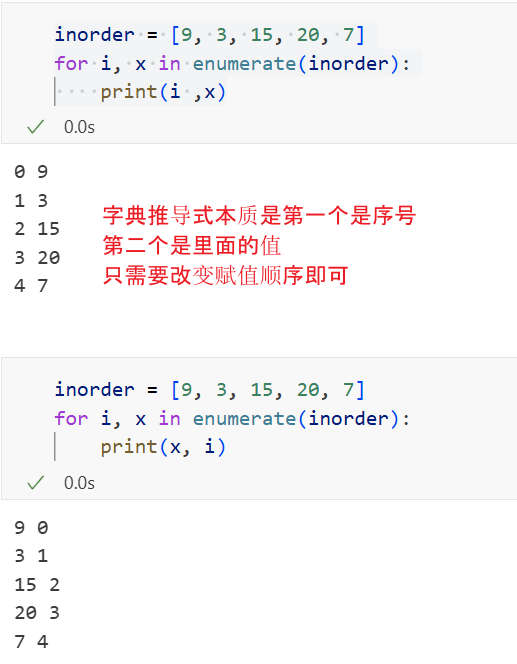

# 从前序与中序遍历序列构造二叉树

## 1. 知识点

> 1. 所以构建二叉树的问题本质上就是：
>
>    1. 找到各个子树的根节点 root
>
>    2. 构建该根节点的左子树
>    3. 构建该根节点的右子树
>    4. 整个过程我们可以用递归来完成。

> 2. ## `index()` 方法到底干什么？
>
>    你用的是这一行：
>
>    ```
>    mid = inorder.index(preorder[0])
>    ```
>
>    ### 1. 语法和作用
>
>    `list.index(x[, start[, end]])`：
>     在列表里**查找元素 x 第一次出现的位置（下标）**，返回一个整数。
>
>    例子：
>
>    ```
>    nums = [10, 20, 30, 20]
>          
>    nums.index(10)   # 返回 0
>    nums.index(20)   # 返回 1 （注意，只返回第一次出现的位置）
>    nums.index(30)   # 返回 2
>    ```
>
>    可以指定起始和结束下标（不常用）：
>
>    ```
>    nums.index(20, 2)      # 从下标 2 往后找 20，返回 3
>    nums.index(20, 2, 3)   # 在 [2,3) 范围找 20，找不到会报错
>    ```
>
>    ### 2. 找不到会怎样？
>
>    如果列表里**没有这个元素**，`index()` 会抛异常：
>
>    ```
>    nums = [1, 2, 3]
>    nums.index(5)   # ValueError: 5 is not in list
>    ```
>
>    在这道题里，因为题目保证：
>
>    - 前序和中序都是**同一棵树**的遍历结果；
>    - 所有值**互不重复**；
>
>    所以 `preorder[0]` 一定能在 `inorder` 里找到，`index()` 不会抛错。

3. 为什么要传递先序和中序都要：

​		因为递归的时候，子树也依然需要根的信息，所以两个序列都需要

​		**问题来了：左子树的根是谁？右子树的根是谁？**

​		光看这两条中序：

​		再递归构造“右子树的右子树”（节点 7 那棵子树）时，你仍然需要用：

- 这一棵子树的 `preorder[0]` 来确定根是谁
- 对应的 `inorder` 用来切左右

**也就是说：每一层递归，仍然是“前序第一个是根 + 中序切左右”。**

所以递归函数必须始终拿着“这一棵子树的 preorder + inorder”，不能只拿中序。	

### 1.1 字典推导式

```python
pos_inorder = {x: i for i, x in enumerate(inorder)}

inorder = [9, 3, 15, 20, 7]
pos_inorder = {9: 0, 3: 1, 15: 2, 20: 3, 7: 4}

root_val = 20
index = pos_inorder[root_val]   # = 3
```

它做了两件事：

1. 用 `enumerate(inorder)` 把 `inorder` 列表变成一串 `(下标, 值)` 的二元组
2. 用“字典推导式” `{key: value for ...}` 把这串二元组变成一个 **字典：值 → 下标** 的映射

所以 `enumerate` 的作用可以记成：

> **“遍历列表时，同时给你下标 i 和元素值 x”**
>
> 

## 1.2 怎么使用：

直接输入pos_inorder[键] 即可获得值

## 2. 算法

```
二、用具体例子一步步模拟运行流程

用 LeetCode 经典例子：

树长这样：

        3
       / \
      9  20
        /  \
       15   7

前序遍历 preorder = [3, 9, 20, 15, 7]
中序遍历 inorder  = [9, 3, 15, 20, 7]


我们从第一次调用开始：

buildTree([3, 9, 20, 15, 7],
          [9, 3, 15, 20, 7])

1️⃣ 第一次调用：整个树，以 3 为根
preorder = [3, 9, 20, 15, 7]
inorder  = [9, 3, 15, 20, 7]


len(inorder) != 0，不返回。

root = TreeNode(preorder[0]) = TreeNode(3)，根节点的值是 3。

mid = inorder.index(preorder[0]) = inorder.index(3)

inorder 是 [9, 3, 15, 20, 7]

3 在里面的下标是 1（从 0 开始）

所以 mid = 1

解释这个 mid = 1 的含义：
在中序遍历中：左 | 根 | 右

inorder: [9] | [3] | [15, 20, 7]
          ^    ^       ^
        左子树  根    右子树


⇒ 左子树有 1 个节点（就是 9）

构造左子树：

root.left = buildTree(
    preorder[1:mid+1],   # preorder[1:2] = [9]
    inorder[:mid]        # inorder[0:1] = [9]
)


即：

buildTree([9], [9])


构造右子树：

root.right = buildTree(
    preorder[mid+1:],    # preorder[2:] = [20, 15, 7]
    inorder[mid+1:]      # inorder[2:] = [15, 20, 7]
)


即：

buildTree([20, 15, 7], [15, 20, 7])


所以第一层的结构已经确定：3 是根，左边去递归 [9], 右边去递归 [20,15,7] / [15,20,7]。

2️⃣ 第二层 —— 构造左子树（只有一个 9）

先看左子树这次递归：

buildTree([9], [9])


len(inorder) = 1 != 0

root = TreeNode(9)

mid = inorder.index(9)

inorder = [9]，9 的下标是 0

所以 mid = 0

切分：

左子树：

preorder[1:mid+1] = preorder[1:1] = []    # 空
inorder[:mid]     = inorder[:0]   = []    # 空


所以：

root.left = buildTree([], [])


进入后 len(inorder) == 0，直接返回 None。

右子树：

preorder[mid+1:] = preorder[1:] = []   # 空
inorder[mid+1:]  = inorder[1:] = []    # 空


所以：

root.right = buildTree([], [])


同样返回 None。

因此 buildTree([9], [9]) 返回的节点就是：

9
/ \
∅  ∅


于是大树的左子树已经构建完毕。

3️⃣ 第二层 —— 构造右子树（以 20 为根）

现在看右子树那次递归：

buildTree([20, 15, 7], [15, 20, 7])


root = TreeNode(preorder[0]) = 20

mid = inorder.index(20)

inorder = [15, 20, 7]

20 的下标是 1

所以 mid = 1

中序切分：

inorder: [15] | [20] | [7]
          左     根     右


左子树有 1 个节点（15），右子树有 1 个节点（7）。

左子树：

root.left = buildTree(
    preorder[1:mid+1],   # preorder[1:2] = [15]
    inorder[:mid]        # inorder[:1]  = [15]
)
# => buildTree([15], [15])


右子树：

root.right = buildTree(
    preorder[mid+1:],    # preorder[2:] = [7]
    inorder[mid+1:]      # inorder[2:] = [7]
)
# => buildTree([7], [7])

4️⃣ 第三层 —— 处理 15 和 7

buildTree([15], [15]) 和刚才 [9], [9] 完全一样的模式：

mid = 0

左子树参数切出来是 ([], []) → None

右子树参数切出来是 ([], []) → None

返回一个叶子节点 15

buildTree([7], [7]) 同理，返回一个叶子节点 7。

于是右子树变成：

    20
   /  \
  15   7

5️⃣ 拼回整棵树

现在所有递归返回都结束了，最外层的树结构就是：

        3
       / \
      9  20
        /  \
       15   7


也就是题目原来的那棵树，构造成功 ✅
```

```python
# Definition for a binary tree node.
# class TreeNode:
#     def __init__(self, val=0, left=None, right=None):
#         self.val = val
#         self.left = left
#         self.right = right
class Solution:
    def buildTree(self, preorder: List[int], inorder: List[int]) -> Optional[TreeNode]:
        if len(inorder) == 0:
            return None
        # 前序遍历第一个值未根节点
        root = TreeNode(preorder[0])
        # 因为没有重复元素，所以可以直接根据值来查找根节点在中序遍历中的位置
        mid = inorder.index(preorder[0])
        # 构建左子树, 为什么这里要传俩序列，因为要确定顺序，同时因为返回到index是其实就是前面的个数，所以先序中根后面的就是左子树
        root.left = self.buildTree(preorder[1:mid+1], inorder[:mid])
         # 构建右子树
        root.right = self.buildTree(preorder[mid+1:], inorder[mid+1:])
        
        return root
```

优化方法：

不再频繁做 `preorder[1:mid+1]` 这样的切片（会额外拷贝数组，慢）

用“**下标区间 + 哈希表**”的方式来定位左右子树，更快更省内存

```python
preorder = [3, 9, 20, 15, 7]   # 根→左→右
inorder  = [9, 3, 15, 20, 7]   # 左→根→右
class Solution:
    def buildTree(self, preorder: List[int], inorder: List[int]) -> Optional[TreeNode]:
        pos_inorder = {x:i for i, x in enumerate(inorder)}

        def dfs(pre_l, pre_r, in_l, in_r):
            if pre_l == pre_r:
                return None
            left_size = pos_inorder[preorder[pre_l]]-in_l
            left = dfs(pre_l + 1, pre_l + 1 + left_size, in_l, in_l + left_size)
            right = dfs(pre_l + 1 + left_size, pre_r, in_l + 1 +left_size, in_r)
            return TreeNode(preorder[pre_l], left, right)
        
        return dfs(0, len(preorder), 0, len(inorder))
```

注意这个是顶层：==return dfs(0, len(preorder), 0, len(inorder))==

执行过程：

```
2. 顶层调用：整棵树
return dfs(0, len(preorder), 0, len(inorder))
# 即 dfs(0, 5, 0, 5)


我们在每一步都写出“当前看到的子数组”：

调用 ①：dfs(0, 5, 0, 5) （整棵树）

当前前序片段：preorder[0:5] = [3, 9, 20, 15, 7]

当前中序片段：inorder[0:5] = [9, 3, 15, 20, 7]

进入函数：

pre_l = 0, pre_r = 5, in_l = 0, in_r = 5
if pre_l == pre_r:  # 0!=5，不返回
    ...

root_val = preorder[pre_l] = preorder[0] = 3
left_size = pos_inorder[3] - in_l = 1 - 0 = 1


left_size = 1 说明：左子树有 1 个节点

根据“前序 = 根 + 左 + 右”和“中序 = 左 + 根 + 右”，可得：

当前子树的前序 [3, 9, 20, 15, 7] 中：

3 是根

之后的 1 个元素 9 是左子树前序

剩下 [20, 15, 7] 是右子树前序

当前子树的中序 [9, 3, 15, 20, 7] 中：

9 是左子树中序

3 是根

[15, 20, 7] 是右子树中序

代码里就是用区间来表达这个切分：

left = dfs(pre_l + 1, pre_l + 1 + left_size,
           in_l,       in_l + left_size)

     = dfs(1,        1 + 1,
           0,        0 + 1)
     = dfs(1, 2, 0, 1)

right = dfs(pre_l + 1 + left_size, pre_r,
            in_l + 1 + left_size,  in_r)

      = dfs(0 + 1 + 1, 5,
             0 + 1 + 1, 5)
      = dfs(2, 5, 2, 5)


所以：

左子树递归：dfs(1, 2, 0, 1)

右子树递归：dfs(2, 5, 2, 5)

最终：return TreeNode(3, left, right)

3. 构造左子树：dfs(1, 2, 0, 1)（只有 9）
调用 ②：dfs(1, 2, 0, 1)

先看片段：

前序片段：preorder[1:2] = [9]

中序片段：inorder[0:1] = [9]

进入：

pre_l = 1, pre_r = 2, in_l = 0, in_r = 1
if pre_l == pre_r:  # 1 != 2，不返回

root_val = preorder[1] = 9
left_size = pos_inorder[9] - in_l = 0 - 0 = 0


left_size = 0，说明：

这个节点 9 没有左子树，左子树节点个数为 0。

继续看递归：

left = dfs(pre_l + 1, pre_l + 1 + left_size,
           in_l,       in_l + left_size)

     = dfs(2,        2 + 0,
           0,        0 + 0)
     = dfs(2, 2, 0, 0)

right = dfs(pre_l + 1 + left_size, pre_r,
            in_l + 1 + left_size,  in_r)

      = dfs(2 + 0, 2,
             0 + 1 + 0, 1)
      = dfs(2, 2, 1, 1)

调用 ③：dfs(2, 2, 0, 0)

pre_l == pre_r == 2 → 区间空了 → 返回 None，作为 9 的左孩子

调用 ④：dfs(2, 2, 1, 1)

同样 pre_l == pre_r → 返回 None，作为 9 的右孩子

于是调用 ② 返回：

TreeNode(9, left=None, right=None)


这就是大树的左子树。
```

```
4. 构造右子树：dfs(2, 5, 2, 5)（根 20）
调用 ⑤：dfs(2, 5, 2, 5)

当前片段：

前序：preorder[2:5] = [20, 15, 7]

中序：inorder[2:5] = [15, 20, 7]

进入：

pre_l = 2, pre_r = 5, in_l = 2, in_r = 5

root_val = preorder[2] = 20
left_size = pos_inorder[20] - in_l = 3 - 2 = 1


说明：

右子树这部分的左子树有 1 个节点（就是 15）

切分区间：

左子树：

left = dfs(pre_l + 1, pre_l + 1 + left_size,
           in_l,       in_l + left_size)

     = dfs(3,        3 + 1,
           2,        2 + 1)
     = dfs(3, 4, 2, 3)


右子树：

right = dfs(pre_l + 1 + left_size, pre_r,
            in_l + 1 + left_size,  in_r)

      = dfs(3 + 1, 5,
             2 + 1 + 1, 5)
      = dfs(4, 5, 4, 5)

5. 右子树的左孩子：dfs(3, 4, 2, 3)（15）
调用 ⑥：dfs(3, 4, 2, 3)

片段：

前序：preorder[3:4] = [15]

中序：inorder[2:3] = [15]

进入：

root_val = preorder[3] = 15
left_size = pos_inorder[15] - in_l = 2 - 2 = 0


同样没有左子树：

left  = dfs(4, 4, 2, 2)  # pre_l==pre_r → None
right = dfs(4, 4, 3, 3)  # pre_l==pre_r → None
return TreeNode(15)

6. 右子树的右孩子：dfs(4, 5, 4, 5)（7）
调用 ⑦：dfs(4, 5, 4, 5)

片段：

前序：preorder[4:5] = [7]

中序：inorder[4:5] = [7]

同理：

root_val = 7
left_size = 0
left  = dfs(5,5,4,4) → None
right = dfs(5,5,5,5) → None
return TreeNode(7)

7. 把所有递归“往回拼”

调用⑥返回：节点 15

调用⑦返回：节点 7

调用⑤返回：TreeNode(20, left=15, right=7)

调用②返回：TreeNode(9)

调用①最终返回：TreeNode(3, left=9, right=20)

结构就是我们想要的那棵树：

        3
       / \
      9  20
        /  \
       15   7
```

