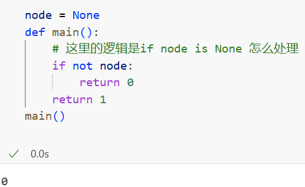

# 序列化和反序列化二叉搜索树

## 1. 算法

1. 序列化

   > 序列化（serialization）在计算机科学的数据处理中，是指将数据结构或对象状态转换成可取用格式（例如存成文件，存于缓冲，或经由网络中发送），以留待后续在相同或另一台计算机环境中，能恢复原先状态的过程。依照序列化格式重新获取字节的结果时，可以利用它来产生与原始对象相同语义的副本。对于许多对象，像是使用大量引用的复杂对象，这种序列化重建的过程并不容易。面向对象中的对象序列化，并不概括之前原始对象所关系的函数。这种过程也称为对象编组（marshalling）。从一系列字节提取数据结构的反向操作，是反序列化（也称为解编组、deserialization、unmarshalling）

2. **树的遍历以及 BFS 和 DFS** 

   1. 树的遍历

      **二叉数的遍历主要有前中后遍历和层次遍历。 前中后属于 DFS，层次遍历则可以使用 BFS 或者 DFS 来实现。只不过使用 BFS 来实现层次遍历会容易些，因为层次遍历就是 BFS 的副产物啊，你可以将层次遍历看成没有提前终止的 BFS**

      - **Depth-First Search (DFS)**

        

      - **Breadth-First Search (BFS)**

        

        > 我们知道：二叉树的深度优先遍历，根据访问根节点的顺序不同，可以将其分为前序遍历，中序遍历, 后序遍历。即如果先访问根节点就是前序遍历，最后访问根节点就是后续遍历，其它则是中序遍历。而左右节点的相对顺序是不会变的，一定是先左后右。
        >
        > 当然也可以设定为先右后左。
        >
        > 并且知道了三种遍历结果中的任意两种即可还原出原有的树结构。这不就是序列化和反序列化么？

   2. 代码举例：

      ```python
      def preorder(self, root):
                  if not root: return []
                  return [str(root.val)]+ self.preorder(root.left) + self.preorder(root.right)
              def inorder(self, root):
                  if not root: return []
                  return self.inorder(root.left) + [str(root.val)] + self.inorder(root.right)
              
      终止条件：root 为 None 返回空列表 []。
      递归：分别对 left、right 子树调用自身。
      注意：[str(root.val)] 是长度为 1 的列表，因此最终结果是列表拼接出来的序列。
      ```

      ```python
              1
             / \
            2   3
           / \   \
          4  5    6
      
      ```

      - 先序遍历

        ```
        一、先序遍历（preorder）：根 → 左 → 右
        
        先序定义：先处理当前节点，再处理左子树，最后处理右子树。
        
        对示例树逐步展开：
        
        preorder(1)
        
        不是空 → 计算
        ["1"] + preorder(2) + preorder(3)
        
        进入 preorder(2)
        
        计算 ["2"] + preorder(4) + preorder(5)
        
        进入 preorder(4)
        
        左、右都是空：
        
        preorder(None) -> []
        
        preorder(None) -> []
        
        返回：["4"] + [] + [] = ["4"]
        
        回到 preorder(2)，继续 preorder(5)
        
        同理，preorder(5) 的左右为空 → 返回 ["5"]
        
        于是 preorder(2) 返回：
        
        ["2"] + ["4"] + ["5"] = ["2","4","5"]
        
        回到 preorder(1)，继续 preorder(3)
        
        计算 ["3"] + preorder(None) + preorder(6)
        
        preorder(None) -> []
        
        preorder(6) 左右皆空 → 返回 ["6"]
        
        所以 preorder(3) 返回：["3"] + [] + ["6"] = ["3","6"]
        
        最终 preorder(1) 返回：
        
        ["1"] + ["2","4","5"] + ["3","6"]
        
        结果：["1","2","4","5","3","6"]
        
        先序结果：['1', '2', '4', '5', '3', '6']
        ```

      - 中序遍历

        ```
        二、中序遍历（inorder）：左 → 根 → 右
        
        中序定义：先处理左子树，再处理当前节点，最后处理右子树。
        
        对示例树逐步展开：
        
        inorder(1)
        = inorder(2) + ["1"] + inorder(3)
        
        进入 inorder(2)
        = inorder(4) + ["2"] + inorder(5)
        
        inorder(4)：左右空 → [] + ["4"] + [] = ["4"]
        
        inorder(5)：左右空 → [] + ["5"] + [] = ["5"]
        
        所以 inorder(2) 返回：["4"] + ["2"] + ["5"] = ["4","2","5"]
        
        回到 inorder(1)，继续 inorder(3)
        = inorder(None) + ["3"] + inorder(6)
        
        inorder(None) -> []
        
        inorder(6)：左右空 → ["6"]
        
        得 ["3","6"]
        
        最终 inorder(1) 返回：
        ["4","2","5"] + ["1"] + ["3","6"]
        → ["4","2","5","1","3","6"]
        
        中序结果：['4', '2', '5', '1', '3', '6']
        ```

        

   3. 注意事项：原因在于树的节点可能存在重复元素。也就是说我前面说的知道了三种遍历结果中的任意两种即可还原出原有的树结构是不对的，严格来说应该是如果树中不存在重复的元素，那么知道了三种遍历结果中的任意两种即可还原出原有的树结构。

      聪明的你应该发现了，上面我的代码用了 i = inorder.index(root.val)，如果存在重复元素，那么得到的索引 i 就可能不是准确的。但是，如果题目限定了没有重复元素则可以用这种算法。

3. 反序列化

### 		先序和后序确定根，中序确定左右子树，左右子树框出来了找第一个或者最后一个

​		**先序+中序**

​		**技巧： 先序确定根，中序确定左右子树**

​		先序找到根以后，然后通过中序左边就是左子树右边就是右子树

​		然后再回到先序部分，框出左子树的部分，还是先序确定根， 然后回到中序，确定左右子树

​		

​		**中序+后序**

​		**技巧：后序确定根，中序确定左右子树**

## 2. 代码

### 1. 评测方法

```python
Codec ser  = new Codec();          // 序列化器
Codec deser = new Codec();         // 反序列化器（单独再建一个实例）
String tree = ser.serialize(root); // 把输入的二叉树 root 编码成字符串
TreeNode ans = deser.deserialize(tree); // 再把字符串解码还原为一棵树
return ans;                        // 把还原后的树返回给评测程序比对
```

### 2. 二叉树里至关重要的理解

```python
“if node”和“if not node”一次性讲清楚。核心就是Python 的真值（truthiness）规则。

一、先记住这条总则

在 Python 里，几乎所有对象都被当作 True，只有少数会当作 False：

None、False

数值型的 0：0, 0.0, 0j

空容器：""、[]、{}、set()、range(0) 等

自定义类如果实现了 __bool__ 返回 False 或 __len__ 返回 0

因此：

if node: 等价于 “node 是真” → 常见含义：node 不是 None 且不是空

if not node: 等价于 “node 是假” → 常见含义：node 是 None 或者空

在二叉树的代码里，node 通常是一个 TreeNode 实例。实例对象默认为 True，只有当 node is None 才当作 False。
所以，树题里常见的：
```

==if not node: 意思就是if node is None:== 意思就是它不是节点的时候，它是什么，当然就是空的时候的逻辑，这样去理解

==if node: if node is not None== 当它是一个节点的时候的处理逻辑，正向

```python
def dfs(node):
    if not node:             # 基线：遇到 None（越过叶子）
        return
    dfs(node.left)           # 进入左子树
    # 访问当前节点
    dfs(node.right)          # 进入右子树
    
def dfs(node):
    if node:                 # 只有在有节点时才处理
        dfs(node.left)
        # visit
        dfs(node.right)
```



### 3. return ",".join(map(str, vals))

```python
return ",".join(map(str, vals))
```

```
map(str, vals)
```

- 把可迭代对象 `vals` 中的每个元素都喂给函数 `str`，得到**字符串迭代器**。
- 例如 `vals = [5, 3, 1, 4, 7]` ⇒ 迭代产生：`"5"`, `"3"`, `"1"`, `"4"`, `"7"`（注意：此时还没拼接，只是一个**惰性**迭代器）。

```
",".join( ... )
```

- 用逗号作为**分隔符**，把迭代器里**已经是字符串**的元素连接起来：
- 结果：`"5,3,1,4,7"`。

```
return ...
```

- 把最终拼好的**单个字符串**返回给调用方（评测器期望拿到的就是这个 `str`）。 

以 `vals = [5, 3, 1, 4, 7]` 为例：

1. 先计算右侧参数：`map(str, vals)` → 生成一个迭代器 `m`（惰性的，不占用和 `vals` 等长的内存）。
2. 调用 `",".join(m)`：`join` 开始遍历 `m`：
   - 取到 `"5"` → 暂存
   - 取到 `"3"` → 把 `","` 插在 `"5"` 和 `"3"` 之间 ⇒ `"5,3"`
   - 取到 `"1"` ⇒ `"5,3,1"`
   - 取到 `"4"` ⇒ `"5,3,1,4"`
   - 取到 `"7"` ⇒ `"5,3,1,4,7"`
3. `join` 返回 `"5,3,1,4,7"`，`return` 把它返回。

> ⚠️ 细节：`map(int, data.split(","))` 在 Python3 是**迭代器**，不能下标访问、也不能被多次遍历；要先 `list(...)`。另外，分割左右子树时，建议先找到分界下标，再切片；否则频繁“筛选”会多次遍历。

`vals = map(int, data.split(","))` 得到的是 **map 迭代器**，它**既不能下标访问**（`vals[0]`），也**不宜被多次遍历**（==会被消费==掉）。另外你用同一个 `vals` 同时去构造 `leftVals`/`rightVals` 也会触发这个问题。

## ==第一次听说会被消费的问题，实际执行起来就是执行一次就没有了==

```python
while i < len(arr) and arr[i] < root_val:
    i += 1
它的含义与作用一口气讲清：

这两个判断分别干什么
i < len(arr)：越界保护。保证 arr[i] 这个访问是安全的。

arr[i] < root_val：BST 分界条件。只要当前位置的值还比根小，就说明仍属于左子树的先序部分，指针应继续右移。

为什么要把“越界判断”放在前面？
Python 的 and 是短路求值，从左到右判断：

如果左边为 False（这里即 i >= len(arr)），右边不会再计算，因此不会去访问 arr[i]，避免 IndexError。

只有当 i < len(arr) 成立时，才会进一步判断 arr[i] < root_val。

它在做的事（直观理解）
i 初值为 1，从根后第一个元素开始扫描；

只要“没到末尾 且 当前值 < 根值”，i 就继续加一；

循环停止时：

要么 i == len(arr)：根后面全都小于根，整个剩余序列都是左子树；

要么遇到第一个 arr[i] >= root_val：这个位置就是右子树的起始分界。

例子跟一遍
arr = [5, 3, 1, 4, 7], root_val = 5, i = 1

i=1：1 < 5 and 3 < 5 → True → i=2

i=2：2 < 5 and 1 < 5 → True → i=3

i=3：3 < 5 and 4 < 5 → True → i=4

i=4：4 < 5 and 7 < 5 → 第二个为 False → 退出
最终 i = 4，左子树先序 = arr[1:4] = [3,1,4]，右子树先序 = arr[4:] = [7]。

再看一个边界例：
arr = [10, 1, 2, 3], root_val = 10, 扫到末尾仍然 < 10，最后 i == len(arr) == 4，说明没有右子树。
```

```python
# Definition for a binary tree node.
# class TreeNode:
#     def __init__(self, x):
#         self.val = x
#         self.left = None
#         self.right = None

class Codec:

    def serialize(self, root: Optional[TreeNode]) -> str:
        """Encodes a tree to a single string.
        """
        vals = []
        def preOrder(root):
            if not root: return
            vals.append(root.val)
            preOrder(root.left)
            preOrder(root.right)
            
        preOrder(root)
        return ','.join(map(str, vals))

    def deserialize(self, data: str) -> Optional[TreeNode]:
        """Decodes your encoded data to tree.
        """
        if not data or data == '':
            return None
        vals = list(map(int, data.split(",")))
        def build(arr):
            if not arr:
                return
            root_val = arr[0]
            root = TreeNode(root_val)

            # 对左右两段各自再做“先序首元素为根 + 找分界”，直到切到空为止。
            i = 1
            while i < len(arr) and arr[i] < root_val:
                i += 1

            root.left = build(arr[1:i])
            root.right = build(arr[i:])
            return root

        return build(vals)

# Your Codec object will be instantiated and called as such:
# Your Codec object will be instantiated and called as such:
# ser = Codec()
# deser = Codec()
# tree = ser.serialize(root)
# ans = deser.deserialize(tree)
# return ans
```

