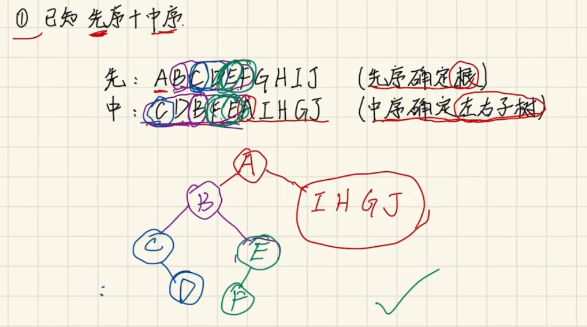

# 序列化和反序列化二叉搜索树

## 1. 算法

1. 序列化

   > 序列化（serialization）在计算机科学的数据处理中，是指将数据结构或对象状态转换成可取用格式（例如存成文件，存于缓冲，或经由网络中发送），以留待后续在相同或另一台计算机环境中，能恢复原先状态的过程。依照序列化格式重新获取字节的结果时，可以利用它来产生与原始对象相同语义的副本。对于许多对象，像是使用大量引用的复杂对象，这种序列化重建的过程并不容易。面向对象中的对象序列化，并不概括之前原始对象所关系的函数。这种过程也称为对象编组（marshalling）。从一系列字节提取数据结构的反向操作，是反序列化（也称为解编组、deserialization、unmarshalling）

2. **树的遍历以及 BFS 和 DFS** 

   1. 树的遍历

      **二叉数的遍历主要有前中后遍历和层次遍历。 前中后属于 DFS，层次遍历则可以使用 BFS 或者 DFS 来实现。只不过使用 BFS 来实现层次遍历会容易些，因为层次遍历就是 BFS 的副产物啊，你可以将层次遍历看成没有提前终止的 BFS**

      - **Depth-First Search (DFS)**

        

      - **Breadth-First Search (BFS)**

        

        > 我们知道：二叉树的深度优先遍历，根据访问根节点的顺序不同，可以将其分为前序遍历，中序遍历, 后序遍历。即如果先访问根节点就是前序遍历，最后访问根节点就是后续遍历，其它则是中序遍历。而左右节点的相对顺序是不会变的，一定是先左后右。
        >
        > 当然也可以设定为先右后左。
        >
        > 并且知道了三种遍历结果中的任意两种即可还原出原有的树结构。这不就是序列化和反序列化么？

   2. 代码举例：

      ```python
      def preorder(self, root):
                  if not root: return []
                  return [str(root.val)]+ self.preorder(root.left) + self.preorder(root.right)
              def inorder(self, root):
                  if not root: return []
                  return self.inorder(root.left) + [str(root.val)] + self.inorder(root.right)
              
      终止条件：root 为 None 返回空列表 []。
      递归：分别对 left、right 子树调用自身。
      注意：[str(root.val)] 是长度为 1 的列表，因此最终结果是列表拼接出来的序列。
      ```

      ```python
              1
             / \
            2   3
           / \   \
          4  5    6
      
      ```

      - 先序遍历

        ```
        一、先序遍历（preorder）：根 → 左 → 右
        
        先序定义：先处理当前节点，再处理左子树，最后处理右子树。
        
        对示例树逐步展开：
        
        preorder(1)
        
        不是空 → 计算
        ["1"] + preorder(2) + preorder(3)
        
        进入 preorder(2)
        
        计算 ["2"] + preorder(4) + preorder(5)
        
        进入 preorder(4)
        
        左、右都是空：
        
        preorder(None) -> []
        
        preorder(None) -> []
        
        返回：["4"] + [] + [] = ["4"]
        
        回到 preorder(2)，继续 preorder(5)
        
        同理，preorder(5) 的左右为空 → 返回 ["5"]
        
        于是 preorder(2) 返回：
        
        ["2"] + ["4"] + ["5"] = ["2","4","5"]
        
        回到 preorder(1)，继续 preorder(3)
        
        计算 ["3"] + preorder(None) + preorder(6)
        
        preorder(None) -> []
        
        preorder(6) 左右皆空 → 返回 ["6"]
        
        所以 preorder(3) 返回：["3"] + [] + ["6"] = ["3","6"]
        
        最终 preorder(1) 返回：
        
        ["1"] + ["2","4","5"] + ["3","6"]
        
        结果：["1","2","4","5","3","6"]
        
        先序结果：['1', '2', '4', '5', '3', '6']
        ```

      - 中序遍历

        ```
        二、中序遍历（inorder）：左 → 根 → 右
        
        中序定义：先处理左子树，再处理当前节点，最后处理右子树。
        
        对示例树逐步展开：
        
        inorder(1)
        = inorder(2) + ["1"] + inorder(3)
        
        进入 inorder(2)
        = inorder(4) + ["2"] + inorder(5)
        
        inorder(4)：左右空 → [] + ["4"] + [] = ["4"]
        
        inorder(5)：左右空 → [] + ["5"] + [] = ["5"]
        
        所以 inorder(2) 返回：["4"] + ["2"] + ["5"] = ["4","2","5"]
        
        回到 inorder(1)，继续 inorder(3)
        = inorder(None) + ["3"] + inorder(6)
        
        inorder(None) -> []
        
        inorder(6)：左右空 → ["6"]
        
        得 ["3","6"]
        
        最终 inorder(1) 返回：
        ["4","2","5"] + ["1"] + ["3","6"]
        → ["4","2","5","1","3","6"]
        
        中序结果：['4', '2', '5', '1', '3', '6']
        ```

        

   3. 注意事项：原因在于树的节点可能存在重复元素。也就是说我前面说的知道了三种遍历结果中的任意两种即可还原出原有的树结构是不对的，严格来说应该是如果树中不存在重复的元素，那么知道了三种遍历结果中的任意两种即可还原出原有的树结构。

      聪明的你应该发现了，上面我的代码用了 i = inorder.index(root.val)，如果存在重复元素，那么得到的索引 i 就可能不是准确的。但是，如果题目限定了没有重复元素则可以用这种算法。

3. 反序列化

### 		先序和后序确定根，中序确定左右子树，左右子树框出来了找第一个或者最后一个

​		**先序+中序**

​		**技巧： 先序确定根，中序确定左右子树**

​		先序找到根以后，然后通过中序左边就是左子树右边就是右子树

​		然后再回到先序部分，框出左子树的部分，还是先序确定根， 然后回到中序，确定左右子树

​		

​		**中序+后序**

​		**技巧：后序确定根，中序确定左右子树**

## 2. 代码