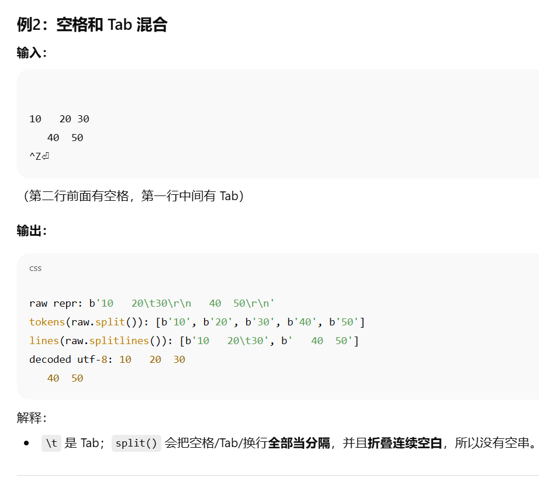

# 翻转二叉树

ctrl+shift+L侧边栏

## 1. 知识点

> 1. 常规思想
>
>    我们在做二叉树题目时候，第一想到的应该是用 **递归 来**解决。
>    仔细看下题目的 输入 和 输出，输出的左右子树的位置跟输入正好是相反的，于是我们可以递归的交换左右子树来完成这道题。

> 2. 迭代思想
>
>    **递归实现也就是深度优先遍历的方式，那么对应的就是广度优先遍历。**
>    **广度优先遍历需要额外的数据结构--队列，来存放临时遍历到的元素。**
>    深度优先遍历的特点是一竿子插到底，不行了再退回来继续；而广度优先遍历的特点是层层扫荡。
>    所以，我们需要先将根节点放入到队列中，然后不断的迭代队列中的元素。
>    对当前元素调换其左右子树的位置，然后：
>
>    判断其左子树是否为空，不为空就放入队列中
>    判断其右子树是否为空，不为空就放入队列中

## 1.2 补充一个核心命令行测试：

```python
data = sys.stdin.read().strip().split()
if not data: return
it = iter(data)
```

解释：

### 1) `s.split()` vs `s.split(' ')` 到底差在哪？

**规则差异：**

- `s.split()`（不带参数）
  - 按“**任意空白**”切分：空格、换行 `\n`、制表符 `\t` 都当分隔符。
  - **自动折叠**：连续多个空白只当**一个**分隔符。
  - 忽略首尾空白。
- `s.split(' ')`（带一个空格作分隔符）
  - **只**把“单个空格字符”当分隔符。
  - 连续空格之间会产生**空串 `''`**。
  - 遇到 `\n`、`\t` 时**不会**切分（因为它们不是空格）。

```python
s1 = "a  b"          # 两个空格
s2 = "  a\tb \n c "  # 首尾空白 + 中间有tab和换行

print(s1.split())      # ['a', 'b']   连续空格被折叠
print(s1.split(' '))   # ['a', '', 'b'] 连续空格之间多了一个空串''

print(s2.split())      # ['a', 'b', 'c'] 任意空白都能切；首尾空白被忽略
print(s2.split(' '))   # ['', '', 'a\tb', '', '\n', 'c', '']
                       # 只按空格切；tab和换行没被切开；连续空格制造了很多''
```


### 2) `it = iter(data)` 变迭代器后怎么用？

先把概念讲清：

- **可迭代对象（iterable）**：能被 `for` 遍历的对象，如 `list/tuple/str`。它本身不会“前进”，每次遍历都会生成一个**迭代器**。
- **迭代器（iterator）**：有“当前位置”的对象，提供 `next(it)` 逐个取值；一旦取过就“消耗”，不能自动回退。取完再 `next` 会抛 `StopIteration`。

`iter(data)` 就是把列表 `data` 变成一个“**可逐个取 token 的消耗流**”。

```python
import sys
data = sys.stdin.buffer.read().split()  # bytes 令牌更快
it = iter(data)

ni = lambda: int(next(it))              # 取下一个整数
ns = lambda: next(it).decode()          # 取下一个字符串（需要decode）
```


### 3. `ni = lambda: int(next(it))` 是什么？

这是在**定义一个匿名函数**，名字叫 `ni`（常用缩写：**n**ext **i**nt，意思是“取下一个整数”）。

这个函数**没有参数**；当你**调用**它时会做两件事：

1. `next(it)`：从迭代器 `it` 里**取出下一个 token**（通常是字符串或 bytes），并把迭代器向前推进一格；
2. `int(...)`：把这个 token 转成整数并**返回**。

### 4) `T = ni()` 是什么？`ni` 得到的是什么结果？`T` 得到什么结果？

- `ni()`：**调用**上面那个函数，效果是**从 `it` 里读一个 token 并转成 int**。
- `T = ni()`：把这个**整数**赋值给变量 `T`。

所以：

- “`ni` 得到什么结果？”——**`ni` 不是结果，是函数**；
- “`ni()` 得到什么结果？”——**得到一个 `int`（迭代器里的下一个整数）**；
- “`T` 得到什么结果？”——**得到这个整数**。

### 5) `n = ni()` 又是什么写法？

完全一样：再**从迭代器**取下一个整数，给变量 `n`。
 之所以常见到 `T = ni()`、`n = ni()`，是因为很多题目格式是：**先读测试组数 T**，然后每组**先读一个 n**，再读接下来 n 个数。


### 6. 常用封装：

```python
ni  = lambda: int(next(it))                 # next int
nf  = lambda: float(next(it))               # next float
nsb = lambda: next(it)                      # next bytes
ns  = lambda: next(it).decode()             # next str（需要字符串时再 decode）
```


### 7. 列表写法：

```python
1) arr = [ni() for _ in range(n)] 是什么？

这是列表推导式：循环 n 次，把每次 ni() 读到的下一个整数放进列表。

ni() 是你定义的快捷函数：ni = lambda: int(next(it))，意思是“从迭代器 it 里取下一个 token，并转成 int”。

下划线 _ 只是占位变量，表示“我不关心循环变量的名字/值”，写成 for _ in range(n) 很常见。

结果：arr 会变成一个长度为 n 的整数列表，同时迭代器被连续消费 n 次。


2) out.append(str(sum(arr))) 是什么？

sum(arr)：把刚读到的 n 个数求和，得到一个整数。

str(...)：把整数转成字符串（因为通常我们最后要把多组答案用 "\n".join(out) 一次性输出）。

out.append(...)：把这一组的答案追加进 out 列表，等待统一输出。


```


### 8. 打印输出：

```python
sys.stdout.write("\n".join(out))
```

一次性打印所有组的答案（每组一行）。


## 2. 代码

1. 递归思想

   ```python
   class Solution(object):
       def invertTree(self, root):
           """
           :type root: TreeNode
           :rtype: TreeNode
           """
           # 1) 递归结束条件：空节点直接返回
           if not root:
               return None
   
           # 2) 交换当前节点的左右子树
           root.left, root.right = root.right, root.left
   
           # 3) 递归翻转（已经交换过位置的）左、右子树
           self.invertTree(root.left)
           self.invertTree(root.right)
   
           # 4) 返回当前节点（此节点为根的整棵子树已翻转完成）
           return root
   ```

   ```python
   2.1 初始树（翻转前）
   
   我们用一棵完全二叉树举例（数字是节点值）：
   
            4
          /   \
         2     7
        / \   / \
       1   3 6   9
   
   
   目标：把每个节点的 left 与 right 交换，翻转后应该变成：
   
            4
          /   \
         7     2
        / \   / \
       9   6 3   1
   
   2.2 递归的调用顺序（先序：根 → 左 → 右）
   
   我用“调用栈帧”的方式展示（invertTree(节点值) 表示以该节点为根的调用）：
   
   调用 invertTree(4)
   
   交换 4.left 和 4.right（2 ↔ 7）
   
   现在 4 的结构临时变为：
   
       4
     /   \
    7     2
   / \   / \
   
   
   6 9 1 3 ← 注意：子树本身还没翻到底层，只是第一层指针换了
   
   - 递归处理**新左子树**：`invertTree(7)`
   - 再递归处理**新右子树**：`invertTree(2)`
   
   
   
   进入 invertTree(7)
   
   交换 7.left 和 7.right（6 ↔ 9）
   
   7 的局部结构变为：
   
     7
    / \
   9   6
   
   
   递归处理 invertTree(9)（新左）
   
   递归处理 invertTree(6)（新右）
   
   进入 invertTree(9)
   
   交换 9.left 和 9.right（二者本来就是 None ↔ None）
   
   递归处理 invertTree(None)（左）→ 直接返回
   
   递归处理 invertTree(None)（右）→ 直接返回
   
   返回节点 9（以 9 为根的子树翻转完成）
   
   回到 invertTree(7)，进入 invertTree(6)
   
   交换 6.left 和 6.right（None ↔ None）
   
   递归左右都是 None，直接返回
   
   返回节点 6（以 6 为根的子树翻转完成）
   
   invertTree(7) 的左右子树都处理完，返回节点 7
   此时整棵以 7 为根的子树已经完全翻转为：
   
     7
    / \
   9   6
   
   
   回到 invertTree(4)，进入 invertTree(2)（还记得第 1 步交换后，4 的右子树是 2）
   
   交换 2.left 和 2.right（1 ↔ 3）
   
   2 的局部结构变为：
   
     2
    / \
   3   1
   
   
   递归 invertTree(3)（新左）
   
   递归 invertTree(1)（新右）
   
   进入 invertTree(3)
   
   交换 3.left 与 3.right（None ↔ None）
   
   递归左右都是 None，返回 3
   
   回到 invertTree(2)，进入 invertTree(1)
   
   交换 1.left 与 1.right（None ↔ None）
   
   递归左右都是 None，返回 1
   
   invertTree(2) 完成，返回 2（子树是 2(3,1)）
   
   invertTree(4) 左右子树都翻好，返回 4。全树翻转完成。
   
   2.3 翻转后的整树
   
   现在整棵树变为：
   
            4
          /   \
         7     2
        / \   / \
       9   6 3   1
   ```

2. 迭代思想

```python
class Solution(object):
	def invertTree(self, root):
		"""
		:type root: TreeNode
		:rtype: TreeNode
		"""
		if not root:
			return None
		# 将二叉树中的节点逐层放入队列中，再迭代处理队列中的元素
		queue = [root]
		while queue:
			# 每次都从队列中拿一个节点，并交换这个节点的左右子树
			tmp = queue.pop(0)
			tmp.left,tmp.right = tmp.right,tmp.left
			# 如果当前节点的左子树不为空，则放入队列等待后续处理
			if tmp.left:
				queue.append(tmp.left)
			# 如果当前节点的右子树不为空，则放入队列等待后续处理	
			if tmp.right:
				queue.append(tmp.right)
		# 返回处理完的根节点
		return root
```


## 2. 补充读写代码：

```python
data = sys.stdin.readlines().strip().split()
sys.stdin.readlines() 返回的是 list[str]，例如：

python
Copy code
["2\n", "5\n", "10 20 30 40 50 \n", "3\n", "7 8 9\n"]
list 没有 .strip() 方法，所以抛出：

pgsql
Copy code
AttributeError: 'list' object has no attribute 'strip'
而你改成：

python
Copy code
data = sys.stdin.buffer.read().split()
就不报错了，因为：

sys.stdin.buffer.read() 一次性把标准输入读成 bytes；

.split()（不带参数）按任意空白切分为 list[bytes]（不会产生空串）；

这个结果正好是我们想要的“令牌流”。
```

| 写法                          | 返回类型    | 速度     | 内存占用 | 适用场景               | 备注                     |
| ----------------------------- | ----------- | -------- | -------- | ---------------------- | ------------------------ |
| `input()`                     | `str`       | 慢       | 低       | 小数据、练习           | 自带去掉末尾换行         |
| `sys.stdin.readline()`        | `str`       | 较快     | 低       | 逐行处理               | 行尾带 `\n`；可配合循环  |
| `sys.stdin.readlines()`       | `list[str]` | 一般     | **高**   | 需要逐行列表，但量不大 | 一次把所有行装入列表     |
| `sys.stdin.read()`            | `str`       | 快       | **高**   | 一次吃完、再手动分词   | 需到 EOF 才返回          |
| `sys.stdin.buffer.readline()` | `bytes`     | 更快     | 低       | 逐行、极致性能         | 需要时再 `.decode()`     |
| `sys.stdin.buffer.read()`     | `bytes`     | **最快** | **高**   | 竞赛常用，一次吃完     | `int()` 可直接吃 `bytes` |

```python
import sys
raw = sys.stdin.buffer.read()
lines = raw.splitlines()            # list[bytes]，每个元素是一行（不带行尾）
print(len(lines))                   # 行数


想知道“输入了多少个数字/单词”？这样写
import sys
tokens = sys.stdin.buffer.read().split()  # 按任意空白切分
print(len(tokens))                         # token 数（数字或单词的个数）

需要把它们当整数用：

it = iter(tokens)
ni = lambda: int(next(it))
```

## 1) 这段列表推导式到底做了什么？

```
[ln for ln in raw.splitlines() if ln.strip()]
```

先看每个部件：

- `raw`：整块读入的**字节/字符串**（例如 `raw = sys.stdin.buffer.read()`）。里面**包含换行符**（Windows 常见 `\r\n`，Linux/macOS 为 `\n`）。

- `raw.splitlines()`：按“行”切分，**去掉每行末尾的换行**，得到一个**列表**，元素是每一行的内容（bytes 或 str）。

- `ln.strip()`：去掉一行**首尾的空白**（空格、`\t`、`\r`、`\n` 等）。

  - 在 `if ln.strip()` 里，它只用于“判断是否为空”：
    - **空白行**（比如只含空格或换行）→ `ln.strip()` 变成空串 → 判定为假 → 被过滤掉；
    - **非空行** → 保留。

- 列表推导整体含义：**保留所有“不是空白行”的行**。注意它**返回的是原行 `ln`**，不是去掉空白后的行；如果你想要“**保留且同时去掉首尾空白**”，写成：

  ```
  [ln.strip() for ln in raw.splitlines() if ln.strip()]
  ```

### 小例子

假设原始字节是（`repr(raw)`）：

```
b'  \nhello world\r\n   123\t \n\nend\r\n'
```

- `raw.splitlines()` 得到：

  ```
  [b'  ', b'hello world', b'   123\t ', b'', b'end']
  ```

- `[ln for ln in raw.splitlines() if ln.strip()]` 结果：

  ```
  [b'hello world', b'   123\t ', b'end']   # 空白行被丢掉，但保留了原行的前后空格
  ```

- `[ln.strip() for ln in raw.splitlines() if ln.strip()]` 结果：

  ```
  [b'hello world', b'123', b'end']         # 既过滤空白行，也把首尾空白去掉
  ```

## 2) `strip().split()` 什么时候该加？不加会怎样？和 `\r\n` 的关系？

先分清**三种常用场景**（结论写在每条的“✅ 推荐”）：

### 场景 A：我要“按**任意空白**切成 token（数字/单词）”

- 常用在竞赛：把整份输入打成令牌流再 `next()` 消费。

- **写法**：

  ```
  tokens = sys.stdin.buffer.read().split()   # list[bytes]
  # 或 tokens = sys.stdin.read().split()     # list[str]
  ```

- **是否需要 `.strip()`？**
   不需要（**多余**）。`split()` 在**不传分隔符**时会：

  - 把任意空白（空格/Tab/换行）都视为分隔；
  - 自动折叠连续空白；
  - 忽略首尾空白；因此**不会产生空串**。

- **关于 `\r\n`**：它们只是分隔符，被吃掉了；`tokens` 里**没有** `\r` 或 `\n`。

- ✅ **推荐**：**直接** `.read().split()`（或 `.buffer.read().split()`），**不要**额外 `.strip()`。

### 场景 B：我要“**逐行**处理”，并且想要**整行文本**（非 token）

- **写法 1：读一行**

  ```
  line = sys.stdin.buffer.readline()           # bytes，含行尾
  line_no_nl = line.rstrip(b'\r\n')            # 去掉行尾换行（跨平台）
  ```

  - **是否需要 `.strip()`？**
     如果你只想去**行尾换行**，**不要**用 `.strip()`，因为 `.strip()` 会把**首尾所有空白**都干掉（包括你可能想保留的前导空格、末尾空格）。
     用 `.rstrip(b'\r\n')` 更精确。

  - #### 关于 ==\r\n==：`readline()` 返回的 `line` **包含**行尾换行；`rstrip(b'\r\n')` 去掉它们。

- **写法 2：整块读后按行**

  ```
  lines = sys.stdin.buffer.read().splitlines()   # 去掉每行的行尾换行
  ```

  - `splitlines()` 会把 `\r\n`/`\n` 都**去掉**；如果要保留空白行就直接用结果；如果要丢弃空白行再加 `if ln.strip()` 过滤。

- ✅ **推荐**：逐行场景用 `readline()` + `rstrip(b'\r\n')`，或一次性 `splitlines()`。

### 场景 C：我要“过滤**空白行**”

- **写法**：

  ```
  lines_no_blank = [ln for ln in raw.splitlines() if ln.strip()]
  # 或顺便把首尾空白也去掉：
  lines_trimmed = [ln.strip() for ln in raw.splitlines() if ln.strip()]
  ```

- **strip 的作用**：只用来判断“这一行是否全是空白”；或者顺手做“去首尾空白”的变换。

- ✅ **推荐**：按需使用 `if ln.strip()` 过滤；是否在结果里 `strip()` 看你的需求。

举例说明：

| 操作                                                    | 结果（repr 展示）              | 说明                                                |
| ------------------------------------------------------- | ------------------------------ | --------------------------------------------------- |
| `raw`                                                   | `b"  a b\tc \r\n \r\n d \n"`   | 原始字节，含空白与换行                              |
| `raw.split()`                                           | `[b'a', b'b', b'c', b'd']`     | 按任意空白切 token，**无空串**，`\r\n` 当分隔符吃掉 |
| `raw.strip()`                                           | `b"a b\tc \r\n \r\n d"`        | 去掉**首尾**空白（前面的两个空格、最后的 `\n`）     |
| `raw.splitlines()`                                      | `[b'  a b\tc ', b' ', b' d ']` | 切成行（**去掉行尾换行**），空白行保留成 `b' '`     |
| `[ln for ln in raw.splitlines() if ln.strip()]`         | `[b'  a b\tc ', b' d ']`       | 丢掉空白行，但行内容**不修剪**                      |
| `[ln.strip() for ln in raw.splitlines() if ln.strip()]` | `[b'a b\tc', b'd']`            | 丢空白行，并**修剪两端空白**                        |



小插曲：注意有时候读取命令行文件的时候，激活conda的内容也会一起读进去导致错误，只需要重新cls然后再运行就好
