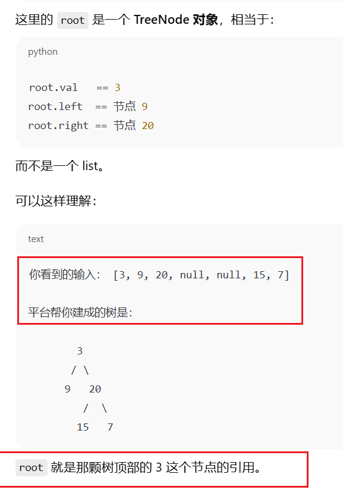
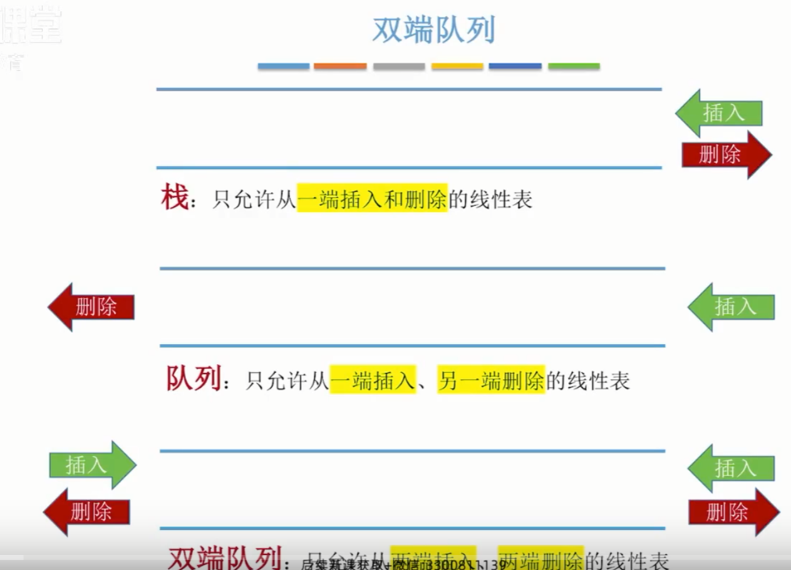
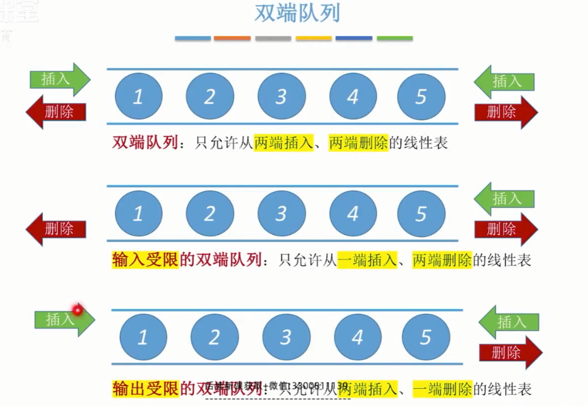
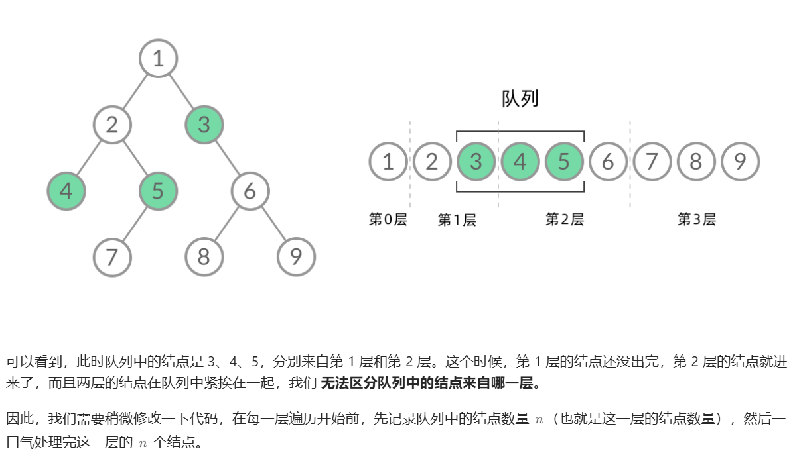

# 二叉树的层序遍历

## 1. 知识点

1. 对比DFS和BFS

   DFS（深度优先搜索）和 BFS（广度优先搜索）就像孪生兄弟，提到一个总是想起另一个。然而在实际使用中，我们用 DFS 的时候远远多于 BFS。那么，是不是 BFS 就没有什么用呢？

   如果我们使用 DFS/BFS 只是为了遍历一棵树、一张图上的所有结点的话，那么 DFS 和 BFS 的能力没什么差别，我们当然更倾向于更方便写、空间复杂度更低的 DFS 遍历。不过，**某些使用场景是 DFS 做不到的，只能使用 BFS 遍历。这就是本文要介绍的两个场景：「层序遍历」、「最短路径」**。

   本文包括以下内容：

   - DFS 与 BFS 的特点比较
   - BFS 的适用场景
   - 如何用 BFS 进行层序遍历
   - 如何用 BFS 求解最短路径问题

2. 区别层序遍历和BFS

​		

	可以看到，此时队列中的结点是 3、4、5，分别来自第 1 层和第 2 层。这个时候，第 1 层的结点还没出完，第 2 层的结点就进来了，而且两层的结点在队列中紧挨在一起，我们 无法区分队列中的结点来自哪一层。

​	因此，我们需要稍微修改一下代码，在每一层遍历开始前，先记录队列中的结点数量 n（也就是这一层的结点数	量），然后一口气处理完这一层的 n 个结点。可以看到，在 **while 循环的每一轮中，都是将当前层的所有结点出队列，再将下一层的所有结点入队列**，这样就实现了层序遍历。

3. 最短路径问题
3. 这里补充一个非常重要的知识：

> ## 一、`root` 是不是 `[3,9,20,null,null,15,7]`？
>
> **不是。**
>
> - LeetCode 输入里写的：`[3,9,20,null,null,15,7]`，这是**数组形式的“层序表示”**，只是给人看的、给平台构造树用的。
> - 平台会先根据这个数组，帮你在后台构造一棵 **二叉树**，然后把这棵树的**根节点**传给你的 `levelOrder` 函数。
>
> 

## 2. 代码

```python
class Solution:
    def levelOrder(self, root: Optional[TreeNode]) -> List[List[int]]:
        if not root: return []
        res, queue = [], collections.deque()
        queue.append(root)
        while queue:
            tmp = []
            for _ in range(len(queue)):
                node = queue.popleft()
                tmp.append(node.val)
                if node.left: queue.append(node.left)
                if node.right: queue.append(node.right)
            res.append(tmp)
        return res
```

Python 中使用 collections 中的双端队列 deque() ，其 popleft() 方法可达到 O(1) 时间复杂度；列表 list 的 pop(0) 方法时间复杂度为 O(N) 。





### 3. 主要问题：

1.==这里存在的问题是==：因为同一层要一个括号放在一起，所以就要求了出队和入队的顺序。



2.双端队列：

**Python 中使用 collections 中的双端队列 deque() ，其 popleft() 方法可达到 O(1) 时间复杂度；列表 list 的 pop(0) 方法时间复杂度为 O(N) 。**

`popleft()` 👉 从左边弹出

`pop()` 👉 从右边弹出

**没有** `popright()`，因为 `pop()` 就是“右边弹出”的意思。

| 操作            | 方向 | 作用                     |
| --------------- | ---- | ------------------------ |
| `append(x)`     | 右   | 在右边插入一个元素       |
| `appendleft(x)` | 左   | 在左边插入一个元素       |
| `pop()`         | 右   | 从右边弹出并返回一个元素 |
| `popleft()`     | 左   | 从左边弹出并返回一个元素 |

